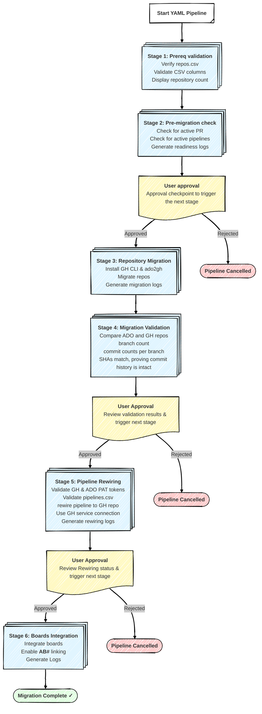

# 🚀 ADO to GitHub Migration Pipeline

[](https://opensource.org/licenses/MIT)
[](https://azure.microsoft.com/en-us/services/devops/)
[](https://github.com/github/gh-ado2gh)

> A production-ready, stage-based Azure DevOps pipeline for migrating repositories from Azure DevOps to GitHub Enterprise at scale. Supports batch migrations, automated validation, pipeline rewiring, and Azure Boards integration.

---

Migrating repositories from Azure DevOps (ADO) to GitHub Enterprise (GHE) using a hybrid approach is inherently challenging due to the multiple stages involved in the end-to-end process. 
Even with automation scripts, this process can be cumbersome and difficult to scale, especially for organizations managing tens of thousands of repositories. I encountered a scenario where an organization needed to migrate nearly 20,000 repositories, making it impractical to rely solely on scripts to execute both migration and post-migration steps in a centralized manner.

To address this scalability challenge, I designed a stage-based Azure DevOps YAML pipeline that encapsulates the entire migration lifecycle from prerequisite validation through successful migration, post-migration rewiring, Azure Boards integration, and safe decommissioning of the ADO repository. This pipeline enables a decentralized, self-service migration model, where individual teams can independently migrate only the repositories they own.

By distributing ownership to teams and allowing migrations to run in parallel, this approach scales effectively for large enterprises, avoids centralized bottlenecks and big-bang migrations, and makes the overall ADO-to-GHE migration process more manageable, controlled, and resilient.

## ✨ Key Features

- 🔄 **6-Stage Pipeline** - Prerequisites validation, pre-migration checks, migration, validation, pipeline rewiring, and boards integration
- ✅ **Automated Validation** - Verifies branch counts, commit counts, and SHA matching to ensure migration integrity
- ⏸️ **Manual Approval Gates** - Three strategic approval points for review and validation
- 📊 **Batch Migration Support** - Migrate 1 to 100+ repositories per run with configurable concurrency
- 🔁 **Idempotent & Resumable** - resume from failure points
- 📝 **Comprehensive Logging** - Detailed artifacts for every stage (migration, validation, rewiring, boards)
- 🔧 **Pipeline Rewiring** - Automatically updates Azure DevOps pipelines to use GitHub repositories
- 🔗 **Azure Boards Integration** - Boards Integration Enables AB# work item linking in GitHub commits and PRs
- 🚀 **Self-Service Ready** - Enables teams to migrate their own repositories independently

---

## 📋 Table of Contents

- [Problem Statement & Solution](#-problem-statement--solution)
- [Prerequisites](#%EF%B8%8F-prerequisites)
- [Quick Start](#-quick-start-your-first-migration)
- [Pipeline Architecture](#%EF%B8%8F-pipeline-stages-overview)
- [Migration at Scale](#-migration-at-scale)
- [Manual Approval Gates](#%EF%B8%8F-manual-approval-gate-guidelines)
- [How to Run](#-how-to-update-reposcsv-and-run-the-pipeline)
- [Understanding Logs](#-understanding-pipeline-logs)
- [Troubleshooting](#-troubleshooting)
- [FAQ](#-frequently-asked-questions)
- [Operational Runbook](#-migration-runbook)
- [Scope & Limitations](#%EF%B8%8F-scope--limitations)
- [Pipeline Structure](#-pipeline-structure)
- [Contributing](#-contributing)
- [License](#-license)

---

## 🎯 Problem Statement & Solution

### The Challenge

Migrating thousands of repositories from Azure DevOps to GitHub at enterprise scale presents several challenges:

- **Script-only approaches don't scale**: Running migration scripts serially from a single machine is too slow for 1,000+ repositories
- **Centralized bottleneck**: One team managing all migrations creates dependency and delays
- **Big-bang risk**: Migrating everything at once increases failure risk and rollback complexity
- **Lack of validation**: Manual post-migration checks are error-prone and time-consuming
- **State management**: Tracking which repos have been migrated, validated, and rewired is complex

### The Solution

This pipeline-based approach solves these challenges by:

✅ **Decentralized self-service**: Teams migrate their own repositories on their own schedule  
✅ **Parallel execution**: Multiple migration batches can run concurrently (within rate limits)  
✅ **Automated validation**: Built-in checks ensure migration completeness (branches, commits, SHAs)  
✅ **Staged approvals**: Manual gates enforce review before proceeding to next stage  
✅ **Comprehensive logging**: Detailed artifacts enable troubleshooting and audit trails  
✅ **Repeatable process**: YAML pipeline ensures consistency across all migrations

---

## ⚙️ Prerequisites

Before running this pipeline, ensure the following requirements are met:

### 1. Operating System
**Required**: Ubuntu Linux (latest) - `vmImage: 'ubuntu-latest'`

The pipeline is designed to run on Microsoft-hosted Azure Pipelines Ubuntu agents. Do not change the VM image unless you have tested compatibility.

### 2. GitHub Organization Preparation

**Before running the pipeline, ensure:**

1. Navigate to `https://github.com/enterprises/<YOUR_ENTERPRISE>/organizations`
2. Verify target GitHub organizations exist (e.g., `mycompany-gh`)
3. Confirm you have **Owner** or **Admin** role in the target organizations
4. If creating new organizations:
   - Follow your organization's GitHub Enterprise org creation process
   - Ensure proper naming conventions are followed
   - Configure organization settings (member privileges, repository defaults, etc.)

**Required GitHub Organization Settings:**
- Member repository creation: Enabled (or admin creates repos beforehand)
- Repository visibility options: Match your `gh_repo_visibility` settings in CSV
- Base permissions: Read (migration will create repos with appropriate teams/permissions)

### 3. GitHub Service Connection Setup (Required for Stage 5)

**Creating the GitHub Service Connection:**

1. Navigate to Azure DevOps: `https://dev.azure.com/<org>/<project>/_settings/adminservices`
2. Click **New service connection** → Select **GitHub**
3. Choose authentication method: **Personal Access Token**
4. Fill in connection details:
   - **Connection name**: `GitHub-<OrgName>-Connection` (e.g., `GitHub-MyCompanyGH-Connection`)
   - **Server URL**: `https://github.com` (or your GitHub Enterprise URL)
   - **Personal Access Token**: Use the same token from `core-entauto-github-migration-secrets` variable group
5. Click **Verify and save**

**Getting the Service Connection ID:**

After creating the connection:
- Open the service connection from the list
- The ID is in the URL: `https://dev.azure.com/<org>/<project>/_settings/adminservices?resourceId=<SERVICE_CONNECTION_ID>`
- Or click on the connection and copy the ID from the details page

**Add the ID to pipelines.csv:**
```csv
org,teamproject,pipeline,github_org,github_repo,serviceConnection
mycompany,Platform,api-ci-pipeline,mycompany-gh,platform-api,12345678-1234-1234-1234-123456789abc
```

> **⚠️ IMPORTANT**: The service connection must have **Contributor** access to the GitHub organization and repositories.

### 4. Personal Access Token (PAT) Setup

**GitHub PAT Creation (Stages 1-5 - Migration):**

1. Navigate to GitHub: `https://github.com/settings/tokens`
2. Click **Generate new token** → **Generate new token (classic)**
3. **Token name**: `ADO-to-GitHub-Migration-Token`
4. **Expiration**: 90 days (recommended) or custom
5. **Select scopes**:
   - ✅ `repo` (Full control of private repositories)
   - ✅ `workflow` (Update GitHub Action workflows)
   - ✅ `admin:org` (Full control of orgs and teams)
   - ✅ `read:user` (Read user profile data)
6. Click **Generate token**
7. **Copy and save the token immediately** (you won't see it again)

**GitHub PAT Creation (Stage 6 - Boards Integration):**

1. Create a **separate** GitHub PAT with limited scopes for security:
   - ✅ `repo` (Full control of private repositories)
   - ✅ `admin:repo_hook` (Full control of repository hooks)
   - ✅ `read:user` (Read user profile data)
   - ✅ `user:email` (Access user email addresses)
2. Name it: `ADO-Boards-Integration-Token`

**Azure DevOps PAT Creation (Stages 1-5 - Migration):**

1. Navigate to: `https://dev.azure.com/<org>/_usersSettings/tokens`
2. Click **New Token**
3. **Name**: `GitHub-Migration-Token`
4. **Organization**: Select your ADO organization
5. **Expiration**: 90 days (custom)
6. **Scopes** (Custom defined):
   - ✅ **Code**: Read & Write
   - ✅ **Build**: Read & Execute
   - ✅ **Service Connections**: Read, Query & Manage
7. Click **Create**
8. **Copy and save the token immediately**

**Azure DevOps PAT Creation (Stage 6 - Boards Integration):**

1. Create a **separate** ADO PAT with limited scopes:
   - ✅ **Code**: Read only
   - ✅ **Work Items**: Read & Write
   - ✅ **Project and Team**: Read
2. Name it: `Boards-Integration-Token`

> **🔒 Security Best Practice**: Use separate PATs for migration vs. boards integration to follow principle of least privilege.

### 5. Variable Group Configuration ⚠️ MANDATORY

This pipeline requires **TWO separate variable groups** for security isolation:

#### A. Migration Variable Group: `core-entauto-github-migration-secrets`

Stages 1–5 (Prerequisites, Pre-Migration Checks, Migration, Validation, and Rewiring) use one set of GitHub PATs, while Stage 6 (Boards Integration) requires separate GitHub PATs with different scopes.

| Variable Name | Description | Required |
|--------------|-------------|----------|
| `GH_PAT` | GitHub Personal Access Token with `admin:org`, `read:user`, `repo`, `workflow` scopes | ✅ Yes |  
| `ADO_PAT` | Azure DevOps PAT with Code (Read, Write), Build, Service Connections scopes | ✅ Yes |

#### B. Boards Integration Variable Group: `azure-boards-integration-secrets`

Used in Stage 6 (Azure Boards Integration) - **SEPARATE token with limited scopes**

| Variable Name | Description | Required |
|--------------|-------------|----------|
| `GH_PAT` | GitHub Personal Access Token with `repo`, `admin:org` scopes | ✅ Yes |  
| `ADO_PAT` | Azure DevOps PAT with Code (Read only), Work Items (Read, Write), Project/Team (Read) - **DIFFERENT from migration ADO_PAT** | ✅ Yes |

> **⚠️ IMPORTANT**: Both variable groups are required for the pipeline to run successfully. If either variable group does not exist, the pipeline will fail. Create them prior to the initial pipeline run. If variable groups are created with different names than those referenced above, the YAML must be updated accordingly.

**Step-by-step instructions to create variable groups:**

1. **Navigate to Library in Azure DevOps:**
   - Open your browser and go to: `https://dev.azure.com/<org>/<project>/_library`
   - Or navigate manually: Click **Pipelines** in the left menu → Click **Library**

2. **Create the first variable group (Migration):**
   - Click the **+ Variable group** button at the top
   - **Variable group name**: Enter `core-entauto-github-migration-secrets` (must match exactly)
   - **Description**: "Migration PAT tokens for ADO to GitHub migration (Stages 1-5)"
   - Click **+ Add** to add `GH_PAT` → paste token → click 🔒 to mark as secret
   - Click **+ Add** to add `ADO_PAT` → paste migration token → click 🔒 to mark as secret
   - Click **Save**

3. **Create the second variable group (Boards Integration):**

4. **Set permissions (if needed):**
   - Click **Pipeline permissions** tab
   - If the pipeline isn't automatically authorized, click **+** and add "ADO to GitHub Migration Pipeline"
   - This allows the pipeline to access the variable group

5. **Save the variable group:**
   - Click **Save** at the top
  
After creating the variable group, you should see:
- Variable group name: `core-entauto-github-migration-secrets`
- 2 variables: `GH_TOKEN` (**secret**), `ADO_PAT` (**secret**)
- Both variables should show 🔒 (locked) indicating they are secret

### 6. Repository CSV File Preparation

The `bash/repos.csv` file must exist with the following structure:

**Required columns:**
- `org` - Azure DevOps organization name
- `teamproject` - Azure DevOps project name
- `repo` - Azure DevOps repository name
- `github_org` - Target GitHub organization
- `github_repo` - Target GitHub repository name
- `gh_repo_visibility` - Repository visibility: `private`, `public`, or `internal`

**Creating repos.csv:**

**Option A: Manual Creation (for < 10 repos)**

```bash
# Create the file
touch bash/repos.csv

# Add header row
echo "org,teamproject,repo,github_org,github_repo,gh_repo_visibility" > bash/repos.csv

# Add repository entries (one per line)
echo "mycompany,Platform,api-service,mycompany-gh,platform-api,private" >> bash/repos.csv
echo "mycompany,Platform,web-frontend,mycompany-gh,platform-web,private" >> bash/repos.csv
```

**Option B: Export from Azure DevOps (recommended for 10+ repos)**

```bash
# Install Azure DevOps CLI extension
az extension add --name azure-devops

# Set default organization
az devops configure --defaults organization=https://dev.azure.com/mycompany

# List all repositories in a project
az repos list --project Platform --output table

# Export to CSV (requires custom script or manual export)
# You can use the Azure DevOps REST API to automate this:
# https://dev.azure.com/mycompany/Platform/_apis/git/repositories
```

**CSV Formatting Best Practices:**
- No spaces after commas unless part of the value
- Quote values containing commas: `"Team Project, Legacy"`
- One repository per line
- No empty lines between entries
- UTF-8 encoding (without BOM)

**Example repos.csv:**

```csv
org,teamproject,repo,github_org,github_repo,gh_repo_visibility
mycompany,Platform,api-service,mycompany-gh,platform-api,private
mycompany,Platform,web-frontend,mycompany-gh,platform-web,internal
mycompany,DataServices,analytics-engine,mycompany-gh,data-analytics,private
mycompany,Mobile,ios-app,mycompany-gh,mobile-ios,private
mycompany,Mobile,android-app,mycompany-gh,mobile-android,private
```

### 7. Pipeline CSV File (Required for Stage 5)
The `bash/pipelines.csv` file must exist with the following structure for pipeline rewiring:

**Required columns:**
- `org` - Azure DevOps organization name
- `teamproject` - Azure DevOps project name
- `pipeline` - Pipeline name/path to rewire
- `github_org` - Target GitHub organization
- `github_repo` - Target GitHub repository name
- `serviceConnection` - Azure DevOps GitHub service connection ID

**Example pipelines.csv:**

```csv
org,teamproject,pipeline,github_org,github_repo,serviceConnection
mycompany,Platform,api-ci-pipeline,mycompany-gh,platform-api,12345678-1234-1234-1234-123456789abc
mycompany,Platform,web-cd-pipeline,mycompany-gh,platform-web,12345678-1234-1234-1234-123456789abc
```

---

## 🚀 Quick Start: Your First Migration

### Prerequisites Checklist

Before running your first migration, ensure you have completed the following:

- [ ] Variable groups created and populated (`core-entauto-github-migration-secrets` and `azure-boards-integration-secrets`)
- [ ] GitHub organizations exist and you have **Owner** access
- [ ] GitHub service connection configured in Azure DevOps (required for Stage 5)
- [ ] `bash/repos.csv` prepared with 1-3 test repositories
- [ ] `bash/pipelines.csv` prepared (if pipeline rewiring is needed)
- [ ] ADO PAT token has required permissions (Code: Read/Write, Build, Service Connections)
- [ ] GitHub PAT token has required scopes (see [Prerequisites](#%EF%B8%8F-prerequisites))

### Step-by-Step First Run

1. **Prepare your repos.csv**
   ```bash
   # Navigate to the repository directory
   cd /path/to/ado2gh-ado-pipelines
   # Windows: cd C:\Users\<username>\ado2gh-ado-pipelines
   
   # Edit repos.csv with your test repositories
   code bash/repos.csv
   ```

2. **Add test repository entries** (start with 1-3 repos):
   ```csv
   org,teamproject,repo,github_org,github_repo,gh_repo_visibility
   mycompany,Platform,api-service,mycompany-gh,platform-api,private
   mycompany,Platform,web-frontend,mycompany-gh,platform-web,private
   ```

3. **Commit and push your changes**:
   ```bash
   git add bash/repos.csv
   git commit -m "Add test repositories for first migration"
   git push
   ```

4. **Run the pipeline**:
   - Navigate to: `https://dev.azure.com/<org>/<project>/_build`
   - Click **ADO to GitHub Migration Pipeline**
   - Click **Run pipeline**
   - Select branch: `main`
   - Click **Run**

5. **Monitor Stage 1** (Prerequisite Validation):
   - Should complete in < 1 minute
   - Validates CSV format and displays repository count
   - Check for any errors

6. **Monitor Stage 2** (Pre-migration Check):
   - Reviews readiness report for active PRs and pipelines
   - Download `readiness-logs` artifact to review findings
   - ⏸️ **APPROVAL REQUIRED**: Review and approve/reject based on findings

7. **Monitor Stage 3** (Repository Migration):
   - Actual migration happens here
   - Monitor logs for progress (can take 2-30 minutes depending on repo size)
   - Download `migration-logs` artifact when complete

8. **Monitor Stage 4** (Migration Validation):
   - Compares branches and commits between ADO and GitHub
   - Download `validation-logs` artifact
   - ⏸️ **APPROVAL REQUIRED**: Review validation results

9. **Monitor Stage 5** (Pipeline Rewiring):
   - Rewires ADO pipelines to use GitHub repos
   - Download `rewiring-logs` artifact
   - ⏸️ **APPROVAL REQUIRED**: Confirm pipelines rewired successfully

10. **Monitor Stage 6** (Boards Integration):
    - Integrates Azure Boards with GitHub repos
    - Download `boards-integration-logs` artifact
    - ✅ **Migration Complete!**

### Example repos.csv Entry

```csv
org,teamproject,repo,github_org,github_repo,gh_repo_visibility
mycompany,Platform,api-service,mycompany-gh,platform-api,private
mycompany,DataServices,analytics-engine,mycompany-gh,data-analytics,internal
mycompany,Mobile,ios-app,mycompany-gh,mobile-ios,private
```

**Column Definitions:**
- `org`: Azure DevOps organization name (e.g., `mycompany`)
- `teamproject`: Azure DevOps project name (e.g., `Platform`)
- `repo`: Azure DevOps repository name (e.g., `api-service`)
- `github_org`: Target GitHub organization (e.g., `mycompany-gh`)
- `github_repo`: Target GitHub repository name (e.g., `platform-api`)
- `gh_repo_visibility`: Repository visibility (`private`, `public`, or `internal`)

---

## ️ Pipeline Stages Overview

This pipeline is designed to run on Ubuntu Linux using Microsoft-hosted Azure Pipelines agents with the `ubuntu-latest` VM image. The pipeline executes 6 stages sequentially, where each stage runs on a completely fresh Ubuntu runner with no state carried over from previous stages.

The three manual approval gates use `pool: server` (no agent required) with a 24-hour timeout, and each regular stage runs with the `condition: succeeded()` to ensure it only executes if the previous stage completed successfully. Since each stage gets a fresh runner, tools like GitHub CLI and the gh-ado2gh extension are reinstalled in every stage that needs them.


> **⚠️ IMPORTANT**: Manual approval gates are enforced after Stage 2, Stage 4, and Stage 5. The pipeline remains paused at the preceding stage until approval is provided. Each of these stages must be manually validated before proceeding to the next stage.

### Stage 1: Prerequisite Validation
- Verifies that `bash/repos.csv` file exists and is not empty
- Validates that the CSV contains all required columns:
  - `org`, `teamproject`, `repo`
  - `github_org`, `github_repo`, `gh_repo_visibility`
- Displays the number of repositories to be migrated

### Stage 2: Pre-migration check
Executes `1_pr_pipeline_check.sh` to:

- Scans source repositories for active pull requests
- Detects active builds, releases pipelines, and pull requests
- Identifies potential blockers before migration begins
- Generates a readiness report
- **⏸️ User approval:** Review readiness before proceeding to next stage 3: Repository Migration

### Stage 3: Repository Migration
Executes `2_migration.sh` to perform the actual migration:

- Installs GitHub CLI and `gh-ado2gh` extension
- Executes parallel migrations (configurable: 1-5 concurrent migrations in the script)
- Migrates repository content, branches, and commit history
- Generates migration status logs for each repository
- Creates a summary CSV with migration results

### Stage 4: Repository Migration Validation
Executes `3_post_migration_validation.sh` to:

-Branch Comparison - Compares branch counts between ADO and GitHub, identifies any missing branches on either side.
-Commit Validation - For each branch, verifies the latest commit SHA matches between ADO and GitHub to ensure complete migration.
-Commit Count Verification - Compares total commit counts per branch between source (ADO) and target (GitHub) to detect any missing commits.
- Generates validation logs with detailed results
- **⏸️ User approval:** Review validation before proceeding to next stage 5: Pipeline Rewiring

### Stage 5: Pipeline Rewiring
Executes `4_rewire_pipeline.sh` to:

- Validate github and ADO tokens.
- Reads pipeline configurations from `bash/pipelines.csv`
- Rewires Azure DevOps pipelines to use GitHub repositories
- Updates service connections and repository sources
- Validates pipeline configurations
- Generates rewiring logs
- **⏸️ User approval:** Review validation before proceeding to next stage 6: boards Integration

### Stage 6: Azure Boards Integration
Executes `5_boards_integration.sh` to:

- Validates GitHub and ADO PAT tokens (for this stage, GitHub PAT tokens should be created with the following scopes: repo; admin:repo_hook; read:user; user:email).
- Integrates Azure Boards with migrated GitHub repositories.
- Enables AB# work item linking in GitHub commits/PRs.


## 📊 Migration at Scale

### Recommended Batch Sizes

The following batch sizes are based on experience migrating thousands of repositories:

| Team Size | Repository Count | Recommended Batch Size | Estimated Duration |
|-----------|-----------------|------------------------|-------------------|
| **Small** | 1-10 repos | Migrate all at once | 30 minutes - 1 hour |
| **Medium** | 10-100 repos | Batch in groups of 10-20 | 1-2 hours per batch |
| **Large** | 100-500 repos | Batch in groups of 50 | 3-4 hours per batch |
| **Enterprise** | 1000+ repos | Batch in groups of 50-100 | Coordinate with platform team |

### Concurrency Settings

Configure the `maxConcurrent` variable in `ado2gh-migration.yml` based on your requirements:

```yaml
variables:
  - group: core-entauto-github-migration-secrets
  - name: maxConcurrent
    value: 3  # Change this value (1-5)
```

**Concurrency Guidelines:**

| Setting | API Pressure | Use Case | Risk Level |
|---------|-------------|----------|-----------|
| **1-2 concurrent** | Low | Conservative approach, minimal API pressure | ✅ Low |
| **3 concurrent** | Medium | **Recommended for most use cases** (default) | ✅ Low |
| **4-5 concurrent** | High | Aggressive migration, may hit rate limits | ⚠️ Medium |

> **⚠️ Rate Limit Warning**: GitHub and Azure DevOps have API rate limits. Setting concurrency too high may result in throttling errors. Monitor for 429 (Too Many Requests) errors in logs.

### Estimated Migration Durations

**Per-Repository Duration (approximate):**

| Repository Size | Commit Count | Estimated Duration |
|----------------|--------------|-------------------|
| Small | < 100 commits | 2-5 minutes |
| Medium | 100-1,000 commits | 5-15 minutes |
| Large | 1,000-10,000 commits | 15-30 minutes |
| Very Large | 10,000+ commits | 30-60 minutes |
| Huge (with LFS) | > 50,000 commits or > 5GB | 1-2 hours |

**Pipeline Overhead:**
- Stage 1 (Prerequisite Validation): ~1 minute
- Stage 2 (Pre-migration Check): ~2-5 minutes
- Stage 4 (Validation): ~5-10 minutes
- Stage 5 (Pipeline Rewiring): ~2-5 minutes
- Stage 6 (Boards Integration): ~2-5 minutes
- **Manual Approval Wait Time**: Variable (minutes to hours depending on availability)

**Example: Migrating 50 medium-sized repositories**
- 50 repos × 10 minutes average = 500 minutes
- With 3 concurrent migrations: 500 ÷ 3 ≈ **167 minutes (~2.8 hours)**
- Plus pipeline overhead: ~15-25 minutes
- Plus approval wait times: Variable
- **Total estimated time: 3-4 hours** (excluding approval wait time)

### Multi-Batch Migration Strategy

For large-scale migrations (100+ repos), use a multi-batch approach:

**1. Prepare Separate CSV Files per Batch:**

```bash
# Batch 1: High-priority repositories
repos-batch1.csv  (50 repositories)

# Batch 2: Medium-priority repositories
repos-batch2.csv  (50 repositories)

# Batch 3: Low-priority repositories
repos-batch3.csv  (50 repositories)
```

**2. Create Separate Branches per Batch:**

```bash
# Create branch for batch 1
git checkout -b migration/batch-1
cp repos-batch1.csv bash/repos.csv
git add bash/repos.csv
git commit -m "Migration batch 1: High-priority repositories"
git push origin migration/batch-1

# Repeat for batch 2, 3, etc.
```

**3. Run Pipelines Sequentially:**
- ✅ Run batch 1 pipeline → Wait for completion → Validate results
- ✅ Run batch 2 pipeline → Wait for completion → Validate results
- ✅ Run batch 3 pipeline → Wait for completion → Validate results

**4. Archive Logs After Each Batch:**
- Download all artifacts (migration-logs, validation-logs, etc.)
- Store in a central location: `/shared/migrations/batch-1/` (or `\\shared\migrations\batch-1\` on Windows)
- Create summary report for each batch

> **⚠️ CRITICAL**: Do NOT run multiple batches in parallel unless you are certain there is no repository overlap. Parallel migrations of the same repository will cause conflicts.

### State Management Across Batches

**Tracking Migration Progress:**

1. **Maintain a master tracking spreadsheet:**
   ```
   Repository Name | Batch # | Migration Date | Status | Validation Status | Notes
   api-service     | 1       | 2025-12-01     | ✅     | ✅                | Success
   web-frontend    | 1       | 2025-12-01     | ⚠️     | ⚠️                | Commit count mismatch on old branch
   ```

2. **Use Git tags to mark completed batches:**
   ```bash
   git tag batch-1-completed -m "Batch 1: 50 repos migrated successfully"
   git push origin batch-1-completed
   ```

3. **Consolidate logs in a central repository:**
   - Create a separate repo: `ado-github-migration-logs`
   - Upload all artifacts after each batch
   - Maintain a README with migration status

---

## ⏸️ Manual Approval Gate Guidelines

This pipeline has **three manual approval gates** that pause execution until a user approves or rejects continuation. Use these guidelines to make informed decisions at each gate.

---

## 🔄 Progressive Filtering Across Stages

The pipeline implements **progressive filtering** to maximize migration throughput while isolating failures. This ensures that successfully processed repositories continue through all stages, while failed repositories are tracked and can be retried separately.

### How It Works

```
┌─────────────────────────────────────────────────────────────────┐
│  INPUT: 10 repositories in repos.csv                            │
└─────────────────────────────────────────────────────────────────┘
                           │
                           ▼
        ┌────────────────────────────────────┐
        │   STAGE 3: Repository Migration    │
        │   ✅ 7 succeed  ❌ 3 fail          │
        └────────────────────────────────────┘
                           │
                           │ repos_stage3_success.csv (7 repos)
                           ▼
        ┌────────────────────────────────────┐
        │   STAGE 4: Migration Validation    │
        │   ✅ 6 succeed  ❌ 1 fails         │
        └────────────────────────────────────┘
                           │
                           │ repos_stage4_success.csv (6 repos)
                           ▼
        ┌────────────────────────────────────┐
        │   STAGE 5: Pipeline Rewiring       │
        │   (Uses pipelines.csv separately)  │
        └────────────────────────────────────┘
                           │
                           ▼
        ┌────────────────────────────────────┐
        │   STAGE 6: Azure Boards Integration│
        │   (Uses 6 validated repos)         │
        └────────────────────────────────────┘

FINAL RESULT: 6 repos fully migrated & integrated
FAILED REPOS: 3 failed migration, 1 failed validation (logged separately)
```

### Key Benefits

✅ **Maximize Success Rate**: 6 out of 10 repos complete all stages (60% success vs 0% in all-or-nothing approach)  
✅ **No Manual CSV Management**: Filtering happens automatically via pipeline artifacts  
✅ **Automatic State Tracking**: Each stage generates filtered CSVs with only successful repos  
✅ **Parallel Failure Tolerance**: One failed repo doesn't block 100 successful repos  
✅ **Retry-Friendly**: Failed repos are logged; simply add them back to repos.csv and re-run

### Automatic Filtering Mechanism

Each stage automatically filters repositories:

| Stage | Input CSV | Output CSV | Filter Criteria |
|-------|-----------|------------|-----------------|
| **Stage 3** (Migration) | `bash/repos.csv` | `repos_stage3_success.csv` | Repositories with successful `gh ado2gh migrate-repo` execution |
| **Stage 4** (Validation) | `repos_stage3_success.csv` (from artifact) | `repos_stage4_success.csv` | Repositories where branch count, commit count, and SHA match |
| **Stage 5** (Rewiring) | `bash/pipelines.csv` (separate input) | N/A | Uses pipelines CSV; tracks success/failure in logs |
| **Stage 6** (Boards) | `repos_stage4_success.csv` (from artifact) | N/A | Integrates only successfully validated repos |

### Pipeline Changes for Progressive Filtering

**1. continueOnError Flags**

All execution tasks now include `continueOnError: true` to prevent job failures when some repos fail:

```yaml
- task: Bash@3
  displayName: 'Execute Migration'
  continueOnError: true  # ← Allows partial failures
```

**2. Artifact Downloads Between Stages**

Each stage downloads filtered CSV artifacts from the previous stage:

```yaml
- task: DownloadBuildArtifacts@1
  displayName: 'Download Migration Results'
  inputs:
    artifactName: 'migration-logs'

- task: Bash@3
  displayName: 'Prepare Validation Input'
  script: |
    cp migration-logs/repos_stage3_success.csv bash/repos.csv
```

**3. Updated Stage Conditions**

Stages now proceed even if previous stage had warnings:

```yaml
condition: in(dependencies.Migration.result, 'Succeeded', 'SucceededWithIssues')
```

### Bash Script Changes

Each bash script now:

1. **Tracks Success/Failure Arrays**:
   ```bash
   MIGRATED=()      # Successfully migrated repos
   FAILED=()        # Failed repos
   ```

2. **Generates Filtered CSV**:
   ```bash
   if (( ${#MIGRATED[@]} > 0 )); then
     SUCCESS_CSV="repos_stage3_success.csv"
     head -n 1 "${CSV_PATH}" > "${SUCCESS_CSV}"
     for repo_info in "${MIGRATED[@]}"; do
       echo "${repo_info}" >> "${SUCCESS_CSV}"
     done
   fi
   ```

3. **Exits with Success on Partial Failures**:
   ```bash
   # Only fail if ALL repos failed
   if (( ${#MIGRATED[@]} == 0 )); then
     exit 1
   fi
   exit 0  # At least 1 repo succeeded
   ```

### Artifact Structure

After each stage, download artifacts to review filtered CSVs:

```
migration-logs/
  ├── repos_stage3_success.csv        # ← 7 successfully migrated repos
  ├── migration_log_2024-01-15.txt    # Full migration log
  └── ...

validation-logs/
  ├── repos_stage4_success.csv        # ← 6 successfully validated repos
  ├── validation_results.txt          # Detailed validation report
  └── ...

rewiring-logs/
  ├── pipeline-rewiring-2024-01-15.txt  # Rewiring log
  └── ...

boards-integration-logs/
  ├── azure-boards-integration-2024-01-15.log  # Boards integration log
  └── ...
```

### Handling Failed Repositories

**Identifying Failures:**

1. **Download artifact** (e.g., `migration-logs`)
2. **Compare input vs output CSV**:
   ```bash
   # Original input: 10 repos
   wc -l bash/repos.csv  # 11 lines (header + 10 repos)
   
   # Successful output: 7 repos
   wc -l migration-logs/repos_stage3_success.csv  # 8 lines (header + 7 repos)
   
   # Failed repos: 10 - 7 = 3 repos
   ```

3. **Check logs** for error messages:
   ```bash
   grep "ERROR" migration-logs/migration_log_*.txt
   ```

**Retrying Failed Repositories:**

1. Create a new CSV with only failed repositories:
   ```csv
   ado_project,ado_repo,gh_org,gh_repo,gh_repo_visibility
   old-project,failed-repo-1,mycompany-gh,failed-repo-1,private
   old-project,failed-repo-2,mycompany-gh,failed-repo-2,private
   old-project,failed-repo-3,mycompany-gh,failed-repo-3,private
   ```

2. Update `bash/repos.csv` with failed repos only
3. Re-run pipeline from Stage 3 (or earlier if needed)

**Important Notes:**

- ⚠️ **Idempotency**: All stages are designed to be re-run safely (migrations won't duplicate repos)
- 📊 **Audit Trail**: All filtered CSVs are preserved in artifacts for audit purposes
- 🔍 **Debugging**: Check `repos_stageX_success.csv` to see exactly which repos passed each stage
- 🚫 **No Manual Editing**: The pipeline manages all CSV filtering automatically; you only provide the initial input

### Example: Progressive Filtering in Action

**Scenario**: Migrating 100 repositories

```
Stage 3 (Migration):     95 succeed → repos_stage3_success.csv (95 repos)
                          5 fail (network timeout, API errors)

Stage 4 (Validation):    92 succeed → repos_stage4_success.csv (92 repos)
                          3 fail (branch count mismatch)

Stage 5 (Rewiring):     Uses pipelines.csv (separate)
                        Tracks successes in logs

Stage 6 (Boards):       92 repos integrated successfully
                        (Uses repos_stage4_success.csv)

OUTCOME: 92 repos fully migrated (92% success rate)
FAILED:   5 migration failures + 3 validation failures (tracked in logs)
```

**Without Progressive Filtering**:
- 1 failed repo would block all 100 repos from continuing → 0% success rate
- Pipeline would fail at Stage 3; Stages 4-6 never execute

**With Progressive Filtering**:
- 95 repos continue to validation
- 92 repos complete all stages
- 8 failed repos can be retried independently
- **92% of repos are production-ready immediately**

---

### Gate 1: After Stage 2 (Pre-Migration Check)

**Location**: Between Stage 2 (Pre-migration Check) and Stage 3 (Repository Migration)

**What to Review:**
1. Download the `readiness-logs` artifact
2. Open the readiness report (CSV or text file)
3. Look for the following indicators:

**BLOCKING Issues (Must REJECT if found):**
- ❌ **Active Pull Requests**: Any PRs in "Active" or "In Progress" state
  - **Action**: Complete, merge, or abandon PRs before proceeding
  - **Reason**: PRs will NOT be migrated; work will be lost
  
- ❌ **Active Pipelines**: Any build or release pipelines currently running
  - **Action**: Wait for completion or cancel pipelines
  - **Reason**: Running pipelines may interfere with migration or cause lock conflicts

**WARNING Issues (Review but may proceed):**
- ⚠️ **Old Branches**: Branches with no commits in 6+ months
  - **Decision**: Acceptable if these are inactive feature branches
  - **Action**: Document which branches are old; verify after migration
  
- ⚠️ **Large Repository Size**: Repositories > 1GB
  - **Decision**: Acceptable but note for extended migration time
  - **Action**: Consider reducing `maxConcurrent` to avoid timeouts

**INFO Items (No action required):**
- ℹ️ Repository statistics (commit count, branch count, size)
- ℹ️ Last commit date
- ℹ️ Repository visibility settings

**Decision Criteria:**
- ✅ **APPROVE**: If NO blocking issues found (active PRs or pipelines)
- ❌ **REJECT**: If ANY blocking issues found; resolve issues and re-run from Stage 1

**Example Approval Decision:**

```
Readiness Report Summary:
- 10 repositories scanned
- 0 active pull requests ✅
- 0 active pipelines ✅
- 2 repositories with old branches (> 6 months) ⚠️
- 1 large repository (1.2GB) ⚠️

Decision: APPROVE - No blocking issues found. Document old branches for post-migration verification.
```

---

### Gate 2: After Stage 4 (Migration Validation)

**Location**: Between Stage 4 (Migration Validation) and Stage 5 (Pipeline Rewiring)

**What to Review:**
1. Download the `validation-logs` artifact
2. Open the validation summary (CSV or text file)
3. Review branch and commit validation results

**BLOCKING Issues (Must REJECT if found):**
- ❌ **Missing Critical Branches**: Main, master, develop, or production branches missing from GitHub
  - **Action**: Re-run migration for affected repositories
  - **Reason**: Critical branches must be present for production readiness
  
- ❌ **Commit SHA Mismatch on Main Branch**: Latest commit SHA differs between ADO and GitHub on main/master/develop
  - **Action**: Re-run migration; verify no commits occurred during migration
  - **Reason**: Indicates incomplete or corrupted migration

- ❌ **Branch Count Mismatch > 10%**: GitHub has significantly fewer branches than ADO
  - **Action**: Investigate missing branches; re-run migration if necessary
  - **Reason**: May indicate migration failure or branch filtering issue

**WARNING Issues (Review carefully):**
- ⚠️ **Commit Count Differs by < 5%**: Small variance in commit count on non-critical branches
  - **Decision**: Acceptable if latest commit SHA matches
  - **Reason**: May be due to squashed merges or rebase history
  
- ⚠️ **Old Feature Branches Missing**: Branches not touched in 6+ months are missing
  - **Decision**: Acceptable if documented and stakeholders notified
  - **Action**: Create list of missing branches for reference

**INFO Items (No action required):**
- ℹ️ Total branches migrated
- ℹ️ Total commits validated
- ℹ️ Migration duration per repository

**Decision Criteria:**
- ✅ **APPROVE**: If NO blocking issues on critical branches (main, develop, production)
- ⚠️ **APPROVE with Documentation**: If only warnings on old feature branches
- ❌ **REJECT**: If ANY blocking issues found; re-run migration and Stage 4

**Example Approval Decision:**

```
Validation Report Summary:
- 10 repositories validated
- Branch count: ADO=52, GitHub=50 ⚠️ (2 old branches missing)
- Main branch SHA: ✅ MATCH on all repos
- Develop branch SHA: ✅ MATCH on all repos
- Commit count variance: < 2% on all branches ✅

Missing branches:
  - api-service: feature/legacy-auth (last commit: 2024-01-15) ⚠️
  - web-frontend: hotfix/old-bug (last commit: 2023-11-20) ⚠️

Decision: APPROVE with Documentation - Critical branches validated successfully. 
Document missing old branches in migration report.
```

---

### Gate 3: After Stage 5 (Pipeline Rewiring)

**Location**: Between Stage 5 (Pipeline Rewiring) and Stage 6 (Boards Integration)

**What to Review:**
1. Download the `rewiring-logs` artifact
2. Open the rewiring summary (CSV or text file)
3. Verify pipeline updates

**BLOCKING Issues (Must REJECT if found):**
- ❌ **Service Connection Authentication Failed**: GitHub service connection cannot authenticate
  - **Action**: Verify service connection PAT token is valid and has correct permissions
  - **Reason**: Pipelines won't be able to access GitHub repositories
  
- ❌ **Pipeline YAML Syntax Errors**: Pipeline definition has syntax errors after rewiring
  - **Action**: Manually review and fix pipeline YAML; re-run Stage 5
  - **Reason**: Pipelines will fail on next trigger
  
- ❌ **Repository Not Found**: GitHub repository referenced in pipeline doesn't exist
  - **Action**: Verify repository was migrated successfully; check naming
  - **Reason**: Pipeline won't be able to clone repository

**WARNING Issues (Review carefully):**
- ⚠️ **Pipeline Not Tested**: Pipeline hasn't been triggered post-rewiring
  - **Decision**: Acceptable but plan for testing
  - **Action**: Schedule pipeline test runs after approval
  
- ⚠️ **Service Connection Permissions**: Service connection has minimal permissions
  - **Decision**: Acceptable if permissions match requirements
  - **Action**: Verify connection can read/write to repository

**INFO Items (No action required):**
- ℹ️ Number of pipelines rewired
- ℹ️ Service connections used
- ℹ️ Repository mappings

**Decision Criteria:**
- ✅ **APPROVE**: If NO blocking issues; all pipelines successfully rewired
- ⚠️ **APPROVE with Testing Plan**: If warnings exist; plan to test pipelines post-migration
- ❌ **REJECT**: If ANY blocking issues found; fix and re-run Stage 5

**Example Approval Decision:**

```
Rewiring Report Summary:
- 5 pipelines rewired
- Service connection: GitHub-MyCompanyGH-Connection ✅
- Authentication: Successful ✅
- Pipeline YAML validation: All passed ✅

Pipelines rewired:
  - api-ci-pipeline: mycompany/Platform/api-service → mycompany-gh/platform-api ✅
  - web-cd-pipeline: mycompany/Platform/web-frontend → mycompany-gh/platform-web ✅

Decision: APPROVE - All pipelines successfully rewired. 
Plan to test pipelines within 24 hours of migration completion.
```

---

## 🔄 Handling Failed Migrations & State Management

### Understanding Migration State

**Key Principles:**
- Each pipeline run is **independent** and stateless
- No migration state is persisted between runs
- Re-running the pipeline with the same `repos.csv` will **attempt to re-migrate** all listed repositories
- The `gh ado2gh migrate` command is **idempotent** (safe to re-run)

### Resuming a Failed Migration

**Scenario**: Pipeline started with 50 repos in CSV, failed at repository #23

**Option 1: Resume from Failure Point (Recommended)**

1. **Download and analyze logs:**
   ```bash
   # Download migration-logs artifact from failed pipeline run
   # Extract to local directory
   cd ~/downloads/migration-logs  # Unix/Mac
   # cd %USERPROFILE%\Downloads\migration-logs  # Windows
   ```

2. **Identify failed repositories:**
   ```bash
   # Open migration-summary.csv
   # Look for status = "failed" or "error"
   ```

3. **Create retry CSV with only failed repos:**
   ```bash
   # Copy header
   head -1 bash/repos.csv > bash/repos-retry.csv
   
   # Add only failed repositories (manual or scripted)
   echo "mycompany,Platform,failed-repo-1,mycompany-gh,failed-repo-1,private" >> bash/repos-retry.csv
   echo "mycompany,Platform,failed-repo-2,mycompany-gh,failed-repo-2,private" >> bash/repos-retry.csv
   ```

4. **Commit and re-run pipeline:**
   ```bash
   git checkout -b migration/retry-batch
   cp bash/repos-retry.csv bash/repos.csv
   git add bash/repos.csv
   git commit -m "Retry failed repositories from original migration"
   git push origin migration/retry-batch
   
   # Run pipeline on migration/retry-batch branch
   ```

**Option 2: Re-run Entire Batch**

Safe if using `gh ado2gh migrate` (GitHub repos will be overwritten if they already exist):

```bash
# Re-run the same pipeline with the original repos.csv
# Previously migrated repos will show "repository already exists" but will be updated
# Failed repos will be re-attempted
```

> ⚠️ **Note**: Re-running may overwrite any manual changes made to already-migrated GitHub repositories.

**Option 3: Manual Investigation & Selective Re-migration**

For complex failures (e.g., authentication errors, rate limiting):

1. **Review detailed logs** for root cause
2. **Fix underlying issue** (e.g., refresh PAT token, increase rate limits)
3. **Test with a single repository** first
4. **Re-run with full or partial CSV** once issue resolved

### Idempotency & Safety

**What is safe to re-run?**

| Stage | Safe to Re-run? | Notes |
|-------|----------------|-------|
| **Stage 1** | ✅ Yes | Always safe; just validates CSV |
| **Stage 2** | ✅ Yes | Always safe; just checks readiness |
| **Stage 3** | ✅ Yes | Safe; `gh ado2gh migrate` is idempotent |
| **Stage 4** | ✅ Yes | Always safe; just validates |
| **Stage 5** | ⚠️ Mostly | Safe but may require manual pipeline validation |
| **Stage 6** | ✅ Yes | Safe; boards integration is idempotent |

**What happens on re-migration?**
- **GitHub repository already exists**: Repository is overwritten with fresh migration from ADO
- **Commits already present**: Duplicate commits are NOT created (Git uses SHA-based deduplication)
- **Branches already exist**: Branches are updated to match ADO state
- **Tags already exist**: Tags are updated if SHA differs

---

## 🛠 How to Update repos.csv and Run the Pipeline

### Updating repos.csv

1. **Edit the CSV file from your local repository:**
   ```bash
   # Navigate to the repository directory
   cd /path/to/ado2gh-ado-pipelines
   # Windows: cd C:\Users\<username>\ado2gh-ado-pipelines
   
   # Edit the CSV file
   code bash/repos.csv
   ```

2. **Add or modify repository entries:**
   - Each row represents one repository to migrate
   - Ensure all required columns have values
   - Use proper CSV formatting (quote fields with commas)
   - Verify `gh_repo_visibility` is one of: `private`, `public`, `internal`

3. **Commit and push changes:**
   ```bash
   git add bash/repos.csv
   git commit -m "Update repos.csv with new repositories"
   git push
   ```

### ▶️ Running the Pipeline

#### Option 1: Via Azure DevOps Web UI
1. Navigate to: https://dev.azure.com/<org>/<project>/_build
2. Click on **ADO to GitHub Migration Pipeline**
3. Click **Run pipeline** button
4. Select branch: `main`
5. Click **Run**

#### Option 2: Via Azure CLI (Advanced)

```bash
# Install Azure DevOps CLI extension
az extension add --name azure-devops

# Set defaults
az devops configure --defaults organization=https://dev.azure.com/<org> project=<project>

# Queue a pipeline run
az pipelines run --name "ADO to GitHub Migration Pipeline" --branch main

# Monitor pipeline run
az pipelines runs show --id <run-id>
```

> **💡 Tip**: For batch management, consider using separate branches per batch (see [Multi-Batch Migration Strategy](#multi-batch-migration-strategy)).

---

## 📄 Pipeline Run Logs

### Accessing Pipeline Logs

#### 1. View Logs in Azure DevOps UI
1. Navigate to the pipeline run: https://dev.azure.com/<org>/<project>/_build
2. Click on the specific build number (e.g., `20251208.5`)
3. Click on any stage or job to view logs
4. Use the **Download logs** button to save all logs as a ZIP file

#### 2. Published Artifacts
The pipeline publishes detailed logs as build artifacts:

**Migration Logs** (from Stage 3: Migration)
- **Artifact Name**: `migration-logs`

 **Migration Validation Logs** (from Stage 4: Migration Validation)
- **Artifact Name**: `validation-logs`

 **Pipeline Rewiring Logs** (from Stage 5: Pipeline Rewiring)
- **Artifact Name**: `rewiring-logs`

 **Boards Integration Logs** (from Stage 6: Boards Integration)
- **Artifact Name**: `boards-integration-logs`
  

**To download artifacts:**
1. Go to the completed pipeline run
2. Click on the **Summary** or **Published** tab
3. Find the **Artifacts** section
4. Click on **migration-logs** or **validation-logs** or **rewiring-logs** or **boards-integration-logs** to download

---

## 📄 Understanding Pipeline Logs

### Stage 3: Migration Log Format

**Example Log Output:**

```plaintext
=== Migrating repository: mycompany/Platform/api-service ===
[INFO] Starting migration at 2025-12-24T10:15:30Z
[INFO] Installing gh-ado2gh extension...
[INFO] Executing: gh ado2gh migrate-repo --ado-org mycompany --ado-team-project Platform --ado-repo api-service --github-org mycompany-gh --github-repo platform-api --visibility private
[SUCCESS] Migration completed in 3m 42s
[INFO] Branches migrated: 5 (main, develop, feature/auth, release/v1.0, hotfix/security)
[INFO] Total commits: 1,247
[INFO] Migration log saved to migration-logs/api-service-20251224-101530.log
```

**Interpreting Migration Results:**

| Log Level | Meaning | Action Required |
|-----------|---------|----------------|
| `[SUCCESS]` | Repository fully migrated | ✅ No action |
| `[WARNING]` | Migration completed with non-critical issues | ⚠️ Review details, may proceed |
| `[ERROR]` | Migration failed | ❌ Review error, retry migration |
| `[INFO]` | Informational message | ℹ️ For reference only |

**Common Migration Log Messages:**

```plaintext
[SUCCESS] Migration completed
→ Repository successfully migrated

[WARNING] Branch 'feature/old' has diverged history
→ Branch may have rebase/force-push history; verify manually

[ERROR] Repository already exists and cannot be overwritten
→ GitHub repo exists; delete it or use different name

[ERROR] Authentication failed: Bad credentials
→ PAT token is invalid or expired; refresh and retry
```

---

### Stage 4: Validation Log Format

**Example Log Output:**

```plaintext
=== Validating: platform-api ===
[CHECK] Branch count: ADO=5, GitHub=5 ✅
[CHECK] Branch 'main': Commits=1247, SHA=a1b2c3d4 ✅ MATCH
[CHECK] Branch 'develop': Commits=1195, SHA=e5f6g7h8 ✅ MATCH
[CHECK] Branch 'feature/auth': Commits=23, SHA=i9j0k1l2 ✅ MATCH
[WARNING] Branch 'release/v1.0': Commit count differs (ADO=45, GH=44) ⚠️
[CHECK] Latest commit SHA matches ✅
[RESULT] VALIDATION PASSED with warnings
```

**Validation Decision Guide:**

| Scenario | Decision | Rationale |
|----------|----------|-----------|
| All branches ✅ | ✅ APPROVE confidently | Perfect migration |
| Warnings on old branches, SHA matches | ✅ APPROVE with documentation | Acceptable variance |
| Errors on main/develop | ❌ REJECT | Critical branches must match |
| Missing critical branches | ❌ REJECT | Re-run migration |
| Commit count differs > 10% | ❌ REJECT | Investigate |

---

## 🔧 Troubleshooting

### Common Issues & Solutions

#### Issue 1: Pipeline Fails at Stage 1 - "repos.csv not found"

**Symptoms:**
```
[ERROR] File not found: bash/repos.csv
Pipeline failed at Stage 1: Prerequisite Validation
```

**Root Cause:**
- CSV file missing from repository
- File in wrong location
- File not committed/pushed to Git

**Solution:**
```bash
# Verify file exists locally
ls bash/repos.csv

# If missing, create it
touch bash/repos.csv
echo "org,teamproject,repo,github_org,github_repo,gh_repo_visibility" > bash/repos.csv

# Add your repositories
echo "mycompany,Platform,api-service,mycompany-gh,platform-api,private" >> bash/repos.csv

# Commit and push
git add bash/repos.csv
git commit -m "Add repos.csv"
git push
```

---

#### Issue 2: Stage 3 Migration Times Out After 60 Minutes

**Symptoms:**
```
[ERROR] Job execution time limit exceeded
Pipeline canceled by system (timeout)
```

**Root Cause:**
- Repository too large (> 5GB)
- Too many concurrent migrations
- Network/API latency

**Solution:**

**Option A: Reduce Batch Size**
```bash
# Split large CSV into smaller batches
# Instead of 100 repos, try 20-30 repos per batch
```

**Option B: Reduce Concurrency**
```yaml
# Edit ado2gh-migration.yml
variables:
  - name: maxConcurrent
    value: 1  # Reduce from 3 to 1
```

**Option C: Increase Pipeline Timeout (if allowed)**
```yaml
# Add to pipeline job definition
jobs:
- job: Migration
  timeoutInMinutes: 360  # 6 hours instead of default 60
```

---

#### Issue 3: Stage 4 Validation - "Branch Count Mismatch" Error

**Symptoms:**
```
[ERROR] Branch count mismatch: ADO=10, GitHub=7
[ERROR] Missing branches: feature/legacy-api, hotfix/bug-123, release/v2.0
```

**Root Cause:**
- Migration didn't complete for all branches
- Branches have invalid names for GitHub
- Network interruption during migration

**Solution:**

**Step 1: Identify Missing Branches**
```bash
# Download validation-logs artifact
# Review detailed validation report
```

**Step 2: Check Branch Names**
```bash
# GitHub doesn't allow certain characters in branch names
# Invalid: feature/my:branch, feature/my?branch
# Valid: feature/my-branch, feature/my_branch

# Check ADO for branch names with special characters
```

**Step 3: Re-run Migration for Affected Repos**
```bash
# Create retry CSV with only affected repositories
echo "org,teamproject,repo,github_org,github_repo,gh_repo_visibility" > bash/repos-retry.csv
echo "mycompany,Platform,api-service,mycompany-gh,platform-api,private" >> bash/repos-retry.csv

# Commit and re-run pipeline
```

---

#### Issue 4: Stage 5 - "Service Connection Authentication Failed"

**Symptoms:**
```
[ERROR] Service connection 'GitHub-MyCompany-Connection' authentication failed
[ERROR] HTTP 401: Unauthorized
```

**Root Cause:**
- GitHub PAT token expired
- Service connection not configured properly
- Wrong service connection ID in pipelines.csv

**Solution:**

**Step 1: Verify Service Connection**
```bash
# Navigate to: https://dev.azure.com/<org>/<project>/_settings/adminservices
# Click on the GitHub service connection
# Click "Verify" to test authentication
```

**Step 2: Update PAT Token if Expired**
```bash
# Generate new GitHub PAT (see Prerequisites section)
# Update service connection with new token
# Click "Verify and save"
```

**Step 3: Verify Service Connection ID**
```bash
# Get ID from URL or service connection details
# Update pipelines.csv with correct ID
```

---

#### Issue 5: Stage 3 - "Repository Already Exists" Error

**Symptoms:**
```
[ERROR] Repository 'mycompany-gh/platform-api' already exists
[ERROR] Cannot create repository: conflict
```

**Root Cause:**
- GitHub repository already exists from previous migration
- Re-running pipeline with same CSV

**Solution:**

**Option A: Delete Existing GitHub Repository**
```bash
# Only if you want to re-migrate completely
# Navigate to GitHub: https://github.com/mycompany-gh/platform-api/settings
# Scroll to "Danger Zone" → "Delete this repository"
# Type repository name to confirm → Delete

# Then re-run pipeline
```

**Option B: Use Different Repository Name**
```csv
# Edit repos.csv
# Change github_repo column to a new name
org,teamproject,repo,github_org,github_repo,gh_repo_visibility
mycompany,Platform,api-service,mycompany-gh,platform-api-v2,private
```

**Option C: Force Overwrite (if supported)**
```bash
# Check if gh ado2gh migrate supports --force flag
gh ado2gh migrate-repo --help | grep force

# If supported, update migration script to include --force
```

---

#### Issue 6: PAT Token Expired Mid-Migration

**Symptoms:**
```
[ERROR] Authentication failed: Token expired
[ERROR] HTTP 401: Unauthorized
```

**Root Cause:**
- PAT token reached expiration date during long migration

**Solution:**

**Step 1: Generate New PAT Tokens**
```bash
# GitHub: https://github.com/settings/tokens
# ADO: https://dev.azure.com/<org>/_usersSettings/tokens
```

**Step 2: Update Variable Groups**
```bash
# Navigate to: https://dev.azure.com/<org>/<project>/_library
# Click on variable group: core-entauto-github-migration-secrets
# Update GH_PAT and ADO_PAT values
# Click Save
```

**Step 3: Re-run Pipeline from Failure Point**
```bash
# Identify which repositories failed
# Create retry CSV with failed repos only
# Re-run pipeline
```

---

#### Issue 7: API Rate Limiting - "429 Too Many Requests"

**Symptoms:**
```
[ERROR] Rate limit exceeded
[ERROR] HTTP 429: Too Many Requests
[WARNING] Retry after 3600 seconds
```

**Root Cause:**
- Too many API calls in short time (high concurrency)
- GitHub or ADO rate limits reached

**Solution:**

**Step 1: Reduce Concurrency**
```yaml
# Edit ado2gh-migration.yml
variables:
  - name: maxConcurrent
    value: 1  # Reduce to 1
```

**Step 2: Wait for Rate Limit Reset**
```bash
# GitHub rate limits reset every hour
# Wait 60 minutes before re-running
```

**Step 3: Use Different PAT Token (if available)**
```bash
# Rate limits are per-token
# Generate new PAT token from different account
# Update variable group
```

---

**Getting Help & Support**

**Internal Support:**
- **Email**: `devops-platform@mycompany.com` (replace with your support contact)
- **Teams Channel**: `Azure DevOps Migrations` (if applicable)
- **Office Hours**: Monday-Friday, 9 AM - 5 PM PST (adjust to your timezone)

**When Requesting Help, Provide:**
1. ✅ Pipeline run URL
2. ✅ Downloaded artifacts (migration-logs, validation-logs, etc.)
3. ✅ repos.csv file (sanitized if contains sensitive info)
4. ✅ Error messages from pipeline logs
5. ✅ Steps already attempted

**Community Support:**
- For bugs or feature requests: [Create an issue](../../issues/new)
- For questions or discussions: [Start a discussion](../../discussions)
- For documentation improvements: [Submit a PR](../../pulls)

---

## ❓ Frequently Asked Questions

### Q1: Can multiple teams run this pipeline simultaneously?

**A:** No, concurrent pipeline runs on the same repository can cause conflicts. **Best practice:**
- Coordinate migration schedules across teams
- Use separate CSV files per team
- Run migrations sequentially, not in parallel
- If absolutely necessary, ensure zero repository overlap between teams

---

### Q2: What happens to the ADO repository after migration?

**A:** The ADO repository remains **intact and unchanged**. Migration is a **copy operation**, not a move.

**Post-Migration:**
- ✅ ADO repository is still accessible
- ✅ All history, branches, and commits remain in ADO
- ⚠️ Stage 6 integrates Azure Boards, but does NOT delete ADO repo
- ⚠️ Decommissioning ADO repositories is a **manual process** (out of scope for this pipeline)

**Recommended Decommissioning Process:**
1. Wait 30 days after migration
2. Verify all teams are using GitHub repository
3. Make ADO repository read-only (disable pushes)
4. Archive or delete ADO repository after 90-day retention period

---

### Q3: Can I migrate repositories from multiple ADO organizations?

**A:** Yes, list all repositories in `repos.csv` with different `org` values.

**Requirements:**
- ✅ ADO PAT token must have access to **all organizations**
- ✅ List repos from different orgs in the same CSV

**Example:**

```csv
org,teamproject,repo,github_org,github_repo,gh_repo_visibility
mycompany,Platform,api-service,mycompany-gh,platform-api,private
anothercompany,Services,data-api,mycompany-gh,data-api,private
```

---

### Q4: How long does a typical migration take?

**A:** Highly variable based on repository size and batch size.

**Examples:**

| Scenario | Batch Size | Avg Repo Size | Concurrency | Estimated Time |
|----------|-----------|---------------|-------------|----------------|
| Small team | 5 repos | 100 commits | 3 | 15-30 minutes |
| Medium team | 20 repos | 500 commits | 3 | 1-2 hours |
| Large team | 50 repos | 1,000 commits | 3 | 3-4 hours |
| Enterprise | 100 repos | 1,000 commits | 3 | 6-8 hours |

**Note:** Does NOT include manual approval wait times (can add hours or days).

---

### Q5: Can I skip Stage 5 (Pipeline Rewiring) if I don't have pipelines?

**A:** No, you cannot skip stages. However, you can provide an **empty `pipelines.csv`** file with just the header row.

**Empty pipelines.csv:**

```csv
org,teamproject,pipeline,github_org,github_repo,serviceConnection
```

Stage 5 will complete quickly with no pipelines to rewire.

---

### Q6: What if the GitHub organization doesn't exist yet?

**A:** Migration will **fail**. GitHub organizations must be **created before running the pipeline**.

**Solution:**
1. Create GitHub organizations manually:
   - Navigate to `https://github.com/enterprises/<YOUR_ENTERPRISE>/organizations`
   - Click "New organization"
   - Follow setup wizard
2. Verify you have **Owner** or **Admin** role
3. Then run the pipeline

---

### Q7: Does this pipeline migrate pull requests?

**A:** No, **pull requests are NOT migrated**.

**What Happens to PRs:**
- ❌ Active PRs in ADO will NOT be transferred to GitHub
- ⚠️ Stage 2 (Pre-migration Check) will **warn if active PRs exist**
- ✅ You must **complete, merge, or abandon PRs** before migration

**Recommendation:**
- Complete all active PRs before migration
- Or manually recreate PRs in GitHub after migration

---

### Q8: Can I migrate private ADO repos to public GitHub repos?

**A:** Yes, use `gh_repo_visibility: public` in repos.csv.

**Security Warning:**
- ⚠️ Migrating private to public **exposes all repository content**
- ⚠️ Commit history, code, and file history become **publicly accessible**
- ⚠️ **Review repository for sensitive data** (API keys, passwords, etc.) before migration

**Recommendation:**
- Scan for secrets using tools like `git-secrets` or `gitleaks`
- Remove sensitive data from history before migration
- Default to `private` unless business requires public

---

### Q9: What happens if migration fails halfway through?

**A:** The pipeline stops, and you can **resume from the failure point**.

**Recovery Steps:**
1. Download `migration-logs` artifact
2. Identify failed repositories in `migration-summary.csv`
3. Create new CSV with only failed repos
4. Re-run pipeline with retry CSV

See [Handling Failed Migrations](#-handling-failed-migrations--state-management) for detailed instructions.

---

### Q10: How do I validate that migration was successful?

**A:** Use the automated validation in **Stage 4**, plus manual verification:

**Automated Validation (Stage 4):**
- ✅ Branch count comparison
- ✅ Commit count comparison per branch
- ✅ Latest commit SHA verification

**Manual Validation:**
1. **Clone GitHub repository locally**:
   ```bash
   git clone https://github.com/mycompany-gh/platform-api.git
   cd platform-api
   ```

2. **Verify branches**:
   ```bash
   git branch -a
   # Compare with ADO branches
   ```

3. **Verify commit history**:
   ```bash
   git log --oneline --all --graph
   # Compare with ADO commit history
   ```

4. **Verify repository size**:
   ```bash
   du -sh .git
   # Should be similar to ADO repo size
   ```

5. **Test build/pipelines** (if applicable)

---

## 📋 Migration Runbook

Use this operational checklist to plan and execute migrations.

### Pre-Migration (T-1 Week)

**Communication:**
- [ ] Announce migration window to repository owners
- [ ] Create communication plan (email template, Teams message, etc.)
- [ ] Schedule migration review meeting

**Preparation:**
- [ ] Validate all target GitHub organizations exist
- [ ] Verify GitHub PAT and ADO PAT tokens are valid and unexpired
- [ ] Create variable groups with PAT tokens
- [ ] Create GitHub service connections in ADO
- [ ] Prepare `repos.csv` with target repositories
- [ ] Prepare `pipelines.csv` for pipeline rewiring (if applicable)

**Testing:**
- [ ] Test pipeline with 1-3 sample repositories (non-production)
- [ ] Verify validation logs and migration logs
- [ ] Confirm approval gates work as expected
- [ ] Test boards integration (Stage 6)

**Stakeholder Alignment:**
- [ ] Get approval from repository owners for migration window
- [ ] Identify migration approvers for approval gates
- [ ] Document rollback plan (if needed)

---

### Migration Day (T-0)

**Pre-Migration Check:**
- [ ] Lock ADO repositories (optional, prevents commits during migration)
  - Navigate to ADO repo settings → Policies → Add policy to block pushes
- [ ] Verify no active PRs in ADO (or plan to complete them)
- [ ] Verify no active pipelines in ADO (or wait for completion)
- [ ] Notify stakeholders migration is starting

**Pipeline Execution:**
- [ ] Commit `repos.csv` to repository and push
- [ ] Run pipeline (via ADO UI or CLI)
- [ ] Monitor **Stage 1** (Prerequisite Validation) - ~1 minute
  - Verify CSV format is valid
  - Note repository count
- [ ] Monitor **Stage 2** (Pre-Migration Check) - ~2-5 minutes
  - Download `readiness-logs` artifact
  - Review for active PRs/pipelines
  - **Approval Gate**: Approve/reject based on readiness report
- [ ] Monitor **Stage 3** (Repository Migration) - ~Variable
  - Watch for errors in pipeline logs
  - Download `migration-logs` artifact when complete
  - Verify migration summary shows successes
- [ ] Monitor **Stage 4** (Migration Validation) - ~5-10 minutes
  - Download `validation-logs` artifact
  - Review branch and commit validation results
  - **Approval Gate**: Approve/reject based on validation report
- [ ] Monitor **Stage 5** (Pipeline Rewiring) - ~2-5 minutes
  - Download `rewiring-logs` artifact
  - Verify pipelines rewired successfully
  - **Approval Gate**: Approve/reject based on rewiring report
- [ ] Monitor **Stage 6** (Boards Integration) - ~2-5 minutes
  - Download `boards-integration-logs` artifact
  - Verify Azure Boards integration successful

**Post-Pipeline:**
- [ ] Verify all repositories accessible in GitHub
- [ ] Test sample repository clone from GitHub
- [ ] Test CI/CD pipeline trigger (if applicable)
- [ ] Verify Azure Boards AB# linking works

---

### Post-Migration (T+1 Day)

**Validation:**
- [ ] Clone each migrated repository and verify branches
- [ ] Run test builds/pipelines on GitHub
- [ ] Verify commit history integrity (spot-check key commits)
- [ ] Verify repository permissions and team access in GitHub

**Communication:**
- [ ] Send completion notification to stakeholders
  - Include migration summary (repos migrated, validation status)
  - Provide GitHub repository URLs
  - Document any issues or warnings
- [ ] Update internal documentation with new GitHub repo links
- [ ] Create post-migration report

**Artifact Management:**
- [ ] Archive all pipeline logs (migration, validation, rewiring, boards)
- [ ] Store logs in central location: `/shared/migrations/2025-12-24/` (or network share)
- [ ] Create summary spreadsheet with migration status per repo

**ADO Repository Decommissioning (T+30 Days):**
- [ ] Verify all teams using GitHub repository (not ADO)
- [ ] Make ADO repository **read-only**:
  - Settings → Policies → Deny write permissions
  - Add banner: "This repo has been migrated to GitHub: [link]"
- [ ] Schedule ADO repository archival or deletion (T+90 days)

---

## ⚠️ Scope & Limitations

### What This Pipeline DOES Migrate

✅ **Git Repository Content**
- All branches (main, develop, feature, release, hotfix, etc.)
- All tags (version tags, release tags)
- Complete commit history and authorship
- Git LFS objects (if present in ADO)

✅ **Repository Metadata**
- Repository description (if supported by migration tool)
- Repository settings (visibility: public/private/internal)

---

### What This Pipeline DOES NOT Migrate

❌ **Pull Requests**
- Active or closed PRs remain in ADO
- PR comments, reviews, and approvals are NOT migrated
- **Workaround**: Complete all active PRs before migration or manually recreate in GitHub

❌ **Azure DevOps Wikis**
- Wiki content stays in ADO
- **Workaround**: Manually export wiki as Markdown and create GitHub Wiki or repo

❌ **Work Items**
- Work items remain in Azure Boards
- Stage 6 integrates Azure Boards with GitHub (AB# linking)
- Work items are NOT migrated to GitHub Issues

❌ **Build/Release History**
- Pipeline execution history stays in ADO
- Only pipeline **definitions** are rewired (Stage 5)
- Historical build logs are NOT migrated

❌ **Azure Artifacts/Packages**
- NuGet, npm, Maven packages remain in Azure Artifacts
- **Workaround**: Publish packages to GitHub Packages separately

❌ **Repository Permissions**
- ADO repo permissions are NOT transferred to GitHub
- **Workaround**: Configure GitHub teams and permissions manually post-migration

❌ **Branch Policies**
- ADO branch policies (required reviewers, build validation) are NOT migrated
- **Workaround**: Configure GitHub branch protection rules manually

---

### Known Limitations

**Technical Limitations:**

| Limitation | Description | Impact |
|-----------|-------------|--------|
| **Max Concurrent Migrations** | 5 (API rate limit protection) | Migrations slower for large batches |
| **Max Recommended Batch Size** | 100 repositories per run | Large migrations require multiple batches |
| **Pipeline Timeout** | 6 hours (configurable) | Very large repos may timeout |
| **Repository Size Limit** | Recommended < 10GB per repo | Larger repos may timeout or fail |
| **Branch Name Restrictions** | GitHub disallows certain characters (`:`, `?`, `*`) | Branches with special chars may fail |

**Permission Requirements:**

| Resource | Minimum Required Permission | Notes |
|----------|---------------------------|-------|
| **ADO Project** | Project Administrator | For service connection management |
| **GitHub Organization** | Owner or Admin | For repository creation |
| **GitHub Service Connection** | Contributor | For pipeline rewiring |
| **Azure Pipelines** | Build Administrator | For running pipelines |

---

### When NOT to Use This Pipeline

❌ **Single Repository Migration**
- **Reason**: Too much overhead for one repo
- **Alternative**: Use `gh ado2gh migrate-repo` CLI command directly

❌ **Repositories with Complex Monorepo Dependencies**
- **Reason**: Custom transformations required
- **Alternative**: Manual migration with Git subtree/submodule management

❌ **Migrations Requiring Commit History Filtering**
- **Reason**: Pipeline migrates full history as-is
- **Alternative**: Use `git filter-repo` or BFG Repo-Cleaner before migration

❌ **Repositories > 10GB**
- **Reason**: May exceed pipeline timeout limits
- **Alternative**: Migrate individually with increased timeout or use Git LFS cleanup

❌ **Organizations Not Ready for Self-Service**
- **Reason**: Requires understanding of Git, pipelines, and DevOps concepts
- **Alternative**: Coordinate with centralized migration team

---

## 📂 Pipeline Structure

```
ado2gh-ado-pipelines/
├── ado2gh-migration.yml                          # Main pipeline definition (6 stages)
├── bash/
│   ├── 1_migration_readiness_check.sh           # Stage 2: Readiness validation script
│   ├── 2_migration.sh                           # Stage 3: Migration execution script
│   ├── 3_post_migration_validation.sh           # Stage 4: Post-migration validation script
│   ├── 4_rewire_pipeline.sh                     # Stage 5: Pipeline rewiring script
│   ├── 5_boards_integration.sh                  # Stage 6: Azure Boards integration script
│   ├── repos.csv                                # Repository list (required)
│   └── pipelines.csv                            # Pipeline list for rewiring (required for Stage 5)
├── .gitattributes                                # Git line ending configuration
└── README.md                                     # This file
```

---

## 🤝 Contributing

Contributions are welcome! If you'd like to improve this pipeline or documentation:

1. **Fork the repository**
2. **Create a feature branch**: `git checkout -b feature/your-improvement`
3. **Make your changes** and commit: `git commit -m "Add: your improvement description"`
4. **Push to your fork**: `git push origin feature/your-improvement`
5. **Open a Pull Request** with a clear description of your changes

### Reporting Issues

If you encounter bugs or have feature requests:
- Check [existing issues](../../issues) first
- Create a new issue with:
  - Clear description of the problem/request
  - Steps to reproduce (for bugs)
  - Expected vs actual behavior
  - Pipeline logs (if applicable)

### Improving Documentation

Documentation improvements are especially appreciated! If you find:
- Typos or grammatical errors
- Unclear instructions
- Missing information
- Outdated content

Please submit a PR or open an issue.

---

## 📄 License

MIT License

Copyright (c) 2025 Vamsi Cherukuri

Permission is hereby granted, free of charge, to any person obtaining a copy
of this software and associated documentation files (the "Software"), to deal
in the Software without restriction, including without limitation the rights
to use, copy, modify, merge, publish, distribute, sublicense, and/or sell
copies of the Software, and to permit persons to whom the Software is
furnished to do so, subject to the following conditions:

The above copyright notice and this permission notice shall be included in all
copies or substantial portions of the Software.

THE SOFTWARE IS PROVIDED "AS IS", WITHOUT WARRANTY OF ANY KIND, EXPRESS OR
IMPLIED, INCLUDING BUT NOT LIMITED TO THE WARRANTIES OF MERCHANTABILITY,
FITNESS FOR A PARTICULAR PURPOSE AND NONINFRINGEMENT. IN NO EVENT SHALL THE
AUTHORS OR COPYRIGHT HOLDERS BE LIABLE FOR ANY CLAIM, DAMAGES OR OTHER
LIABILITY, WHETHER IN AN ACTION OF CONTRACT, TORT OR OTHERWISE, ARISING FROM,
OUT OF OR IN CONNECTION WITH THE SOFTWARE OR THE USE OR OTHER DEALINGS IN THE
SOFTWARE.

---

**Made with ❤️ for the DevOps community**


