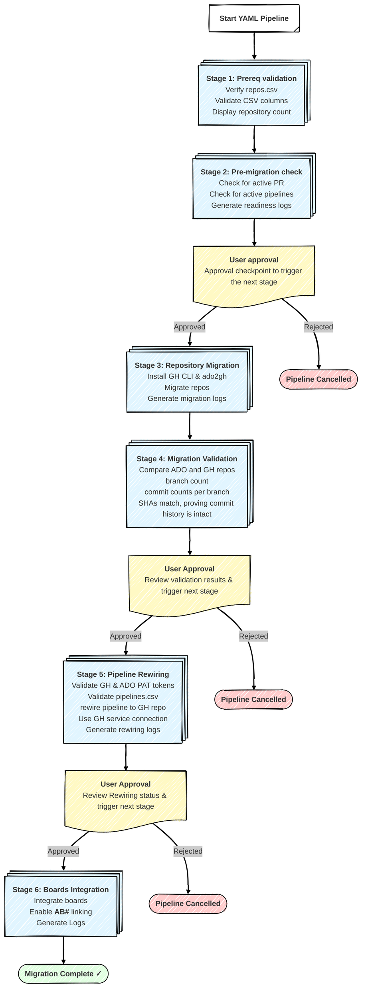

# 🚀 ADO to GitHub Migration Pipeline

Migrating repositories from Azure DevOps (ADO) to GitHub Enterprise (GHE) using a hybrid approach is inherently challenging due to the multiple stages involved in the end-to-end process. This includes prerequisite checks such as installing the GitHub CLI and the ado2gh extension, authenticating with GitHub, and performing pre-migration validations (for example, identifying in-flight pull requests or running pipelines that could be missed during migration). It then proceeds through the actual repository migration, post-migration validation, ADO pipeline rewiring, Azure Boards integration, and finally disabling the ADO repository to prevent further developer usage after a successful migration.

Even with automation scripts, this process can be cumbersome and difficult to scale, especially for organizations managing tens of thousands of repositories. I encountered a scenario where an organization needed to migrate nearly 20,000 repositories, making it impractical to rely solely on scripts to execute both migration and post-migration steps in a centralized manner.

To address this scalability challenge, I designed a stage-based Azure DevOps YAML pipeline that encapsulates the entire migration lifecycle from prerequisite validation through successful migration, post-migration rewiring, Azure Boards integration, and safe decommissioning of the ADO repository. This pipeline enables a decentralized, self-service migration model, where individual teams can independently migrate only the repositories they own.

By distributing ownership to teams and allowing migrations to run in parallel, this approach scales effectively for large enterprises, avoids centralized bottlenecks and big-bang migrations, and makes the overall ADO-to-GHE migration process more manageable, controlled, and resilient.

## pipeline stages overview

```mermaid
---
config:
  theme: neo
  layout: dagre
  look: handDrawn
---
flowchart TB
    Start["<b>Start YAML Pipeline</b>"] --> Stage1["<b>Stage 1: Prereq validation</b><br>Verify repos.csv<br>Validate CSV columns<br>Display repository count"]
    Stage1 --> Stage2["<b>Stage 2: Pre-migration check</b><br>Check for active PR<br>Check for active pipelines<br>Generate readiness logs"]
    Stage2 --> Gate1["<b>User approval</b><br>Approval checkpoint to trigger the next stage"]
    Gate1 -- Approved --> Stage3["<b>Stage 3: Repository Migration</b><br>Install GH CLI &amp; ado2gh<br>Migrate repos<br>Generate migration logs"]
    Gate1 -- Rejected --> End1["<b>Pipeline Cancelled</b>"]
    Stage3 --> Stage4["<b>Stage 4: Migration Validation</b><br>Compare ADO and GH repos<br>branch count<br>commit counts per branch<br>SHAs match, proving commit history is intact"]
    Stage4 --> Gate2["<b>User Approval</b><br>Review validation results &amp; trigger next stage"]
    Gate2 -- Approved --> Stage5["<b>Stage 5: Pipeline Rewiring</b><br>Validate GH &amp; ADO PAT tokens<br>Validate pipelines.csv<br>rewire pipeline to GH repo<br>Use GH service connection<br>Generate rewiring logs"]
    Gate2 -- Rejected --> End2(["<b>Pipeline Cancelled</b>"])
    Stage5 --> Gate3["<b>User Approval</b><br>Review Rewiring status &amp; trigger next stage"]
    Gate3 -- Approved --> Stage6["<b>Stage 6: Boards Integration</b><br>Integrate boards<br>Enable <b>AB#</b> linking<br>Generate Logs"]
    Gate3 -- Rejected --> End3(["<b>Pipeline Cancelled</b>"])
    Stage6 --> Success(["<b>Migration Complete ✓</b>"])

    Start@{ shape: tag-proc}
    Stage1@{ shape: procs}
    Stage2@{ shape: procs}
    Gate1@{ shape: doc}
    Stage3@{ shape: procs}
    End1@{ shape: terminal}
    Stage4@{ shape: procs}
    Gate2@{ shape: doc}
    Stage5@{ shape: procs}
    Gate3@{ shape: doc}
    Stage6@{ shape: procs}
    style Stage1 fill:#e1f5ff,stroke-width:1px,stroke-dasharray: 0
    style Stage2 fill:#e1f5ff
    style Gate1 fill:#FFF9C4
    style Stage3 fill:#e1f5ff
    style End1 fill:#ffcccc
    style Stage4 fill:#e1f5ff
    style Gate2 fill:#FFF9C4
    style Stage5 fill:#e1f5ff
    style End2 fill:#ffcccc
    style Gate3 fill:#FFF9C4
    style Stage6 fill:#e1f5ff
    style End3 fill:#ffcccc
    style Success fill:#e1ffe1
```

### Stage 1: Prerequisite Validation
- Verifies that `bash/repos.csv` file exists and is not empty
- Validates that the CSV contains all required columns:
  - `org`, `teamproject`, `repo`
  - `github_org`, `github_repo`, `gh_repo_visibility`
- Displays the number of repositories to be migrated

### Stage 2: Pre-migration check
Executes `1_pr_pipeline_check.sh` to:

- Scans source repositories for active pull requests
- Detectes active builds, releases pipelines, and pull requests
- Identifies potential blockers before migration begins
- Generates a readiness report
- **⏸️ User approval:** Review readiness before proceeding to next stage 3: Repository Migration

### Stage 3: Repository Migration
Executes `2_migration.sh` to perform the actual migration:

- Installs GitHub CLI and `gh-ado2gh` extension
- Executes parallel migrations (configurable: 1-5 concurrent migrations in the script)
- Migrates repository content, branches, and commit history
- Generates migration status logs for each repository
- Creates a summary CSV with migration results

### Stage 4: Repository Migration Validation
Executes `3_post_migration_validation.sh` to:

-Branch Comparison - Compares branch counts between ADO and GitHub, identifies any missing branches on either side.
-Commit Validation - For each branch, verifies the latest commit SHA matches between ADO and GitHub to ensure complete migration.
-Commit Count Verification - Compares total commit counts per branch between source (ADO) and target (GitHub) to detect any missing commits.
- Generates validation logs with detailed results
- **⏸️ User approval:** Review validation before proceeding to next stage 5: Pipeline Rewiring

### Stage 5: Pipeline Rewiring
Executes `4_rewire_pipeline.sh` to:

- Validate github and ADO tokens.
- Reads pipeline configurations from `bash/pipelines.csv`
- Rewires Azure DevOps pipelines to use GitHub repositories
- Updates service connections and repository sources
- Validates pipeline configurations
- Generates rewiring logs

### Stage 6: Azure Boards Integration (Manual Approval Required)
- **⏸️ Manual Approval Gate:** Review rewiring before Boards integration
Executes `5_boards_integration.sh` to:

- Validates github and ADO PAT tokens (for this stage github PAT tokens should created with the follwing scope: repo; admin:repo_hook; read:user; user:email).
- Integrates Azure Boards with migrated GitHub repositories.
- Enables AB# work item linking in GitHub commits/PRs.

## ⚙️ Prerequisites

Before running this pipeline, ensure the following requirements are met:

### 1. Variable Group Configuration ⚠️ MANDATORY

This pipeline requires **TWO separate variable groups** for security isolation:

#### A. Migration Variable Group: `core-entauto-github-migration-secrets`

Stages 1–5 (Prerequisites, Pre-Migration Checks, Migration, Validation, and Rewiring) use one set of GitHub PATs, while Stage 6 (Boards Integration) requires separate GitHub PATs with different scopes.

| Variable Name | Description | Required |
|--------------|-------------|----------|
| `GH_PAT` | GitHub Personal Access Token with `admin:org`, `read:user`, `repo`, `workflow` scopes | ✅ Yes |  
| `ADO_PAT` | Azure DevOps PAT with Code (Read, Write), Build, Service Connections scopes | ✅ Yes |

#### B. Boards Integration Variable Group: `azure-boards-integration-secrets`

Used in Stage 6 (Azure Boards Integration) - **SEPARATE token with limited scopes**

| Variable Name | Description | Required |
|--------------|-------------|----------|
| `GH_PAT` | GitHub Personal Access Token with `repo`, `admin:org` scopes | ✅ Yes |  
| `ADO_PAT` | Azure DevOps PAT with Code (Read only), Work Items (Read, Write), Project/Team (Read) - **DIFFERENT from migration ADO_PAT** | ✅ Yes |

> **⚠️ IMPORTANT**: Both variable groups are required for the pipeline to run successfully. If either variable group does not exist, the pipeline will fail. Create them prior to the initial pipeline run. If variable groups are created with different names than those referenced above, the YAML must be updated accordingly.

**Step-by-step instructions to create variable groups:**

1. **Navigate to Library in Azure DevOps:**
   - Open your browser and go to: `https://dev.azure.com/<org>/<project>/_library`
   - Or navigate manually: Click **Pipelines** in the left menu → Click **Library**

2. **Create the first variable group (Migration):**
   - Click the **+ Variable group** button at the top
   - **Variable group name**: Enter `core-entauto-github-migration-secrets` (must match exactly)
   - **Description**: "Migration PAT tokens for ADO to GitHub migration (Stages 1-5)"
   - Click **+ Add** to add `GH_PAT` → paste token → click 🔒 to mark as secret
   - Click **+ Add** to add `ADO_PAT` → paste migration token → click 🔒 to mark as secret
   - Click **Save**

3. **Create the second variable group (Boards Integration):**

4. **Set permissions (if needed):**
   - Click **Pipeline permissions** tab
   - If the pipeline isn't automatically authorized, click **+** and add "ADO to GitHub Migration Pipeline"
   - This allows the pipeline to access the variable group

5. **Save the variable group:**
   - Click **Save** at the top
  
After creating the variable group, you should see:
- Variable group name: `core-entauto-github-migration-secrets`
- 2 variables: `GH_TOKEN` (**secret**), `ADO_PAT` (**secret**)
- Both variables should show 🔒 (locked) indicating they are secret


### 2. Repository CSV File
The `bash/repos.csv` file must exist with the following structure:

**Required columns:**
- `org` - Azure DevOps organization name
- `teamproject` - Azure DevOps project name
- `repo` - Azure DevOps repository name
- `github_org` - Target GitHub organization
- `github_repo` - Target GitHub repository name
- `gh_repo_visibility` - Repository visibility: `private`, `public`, or `internal`

### 5. Pipeline CSV File (Required for Stage 5)
The `bash/pipelines.csv` file must exist with the following structure for pipeline rewiring:

**Required columns:**
- `org` - Azure DevOps organization name
- `teamproject` - Azure DevOps project name
- `pipeline` - Pipeline name/path to rewire
- `github_org` - Target GitHub organization
- `github_repo` - Target GitHub repository name
- `serviceConnection` - Azure DevOps GitHub service connection ID

## How to Update repos.csv and Run the Pipeline

### 🛠 Updating repos.csv

1. **Edit the CSV file from you local:**
   ```bash
   # Navigate to the local dir
   cd c:\Users\<username>\factory\ado2gh-ado-pipelines
   
   # Edit the CSV file
   code bash/repos.csv
   ```

2. **Add or modify repository entries:**
   - Each row represents one repository to migrate
   - Ensure all required columns have values
   - Use proper CSV formatting (quote fields with commas)
   - Verify `gh_repo_visibility` is one of: `private`, `public`, `internal`

3. **Commit and push changes:**
   ```bash
   git add bash/repos.csv
   git commit -m "Update repos.csv with new repositories"
   git push
   ```

### ▶️ Running the Pipeline

#### Option 1: Via Azure DevOps Web UI
1. Navigate to: https://dev.azure.com/<org>/<project>/_build
2. Click on **ADO to GitHub Migration Pipeline**
3. Click **Run pipeline** button
4. Select branch: `main`
5. Click **Run**

### Configuring Concurrent Migrations

You can adjust the number of concurrent migrations by modifying the `maxConcurrent` variable in `ado2gh-migration.yml`:

```yaml
variables:
  - group: core-entauto-github-migration-secrets
  - name: maxConcurrent
    value: 3  # Change this value (1-5)
```

## 📄 Pipeline Run Logs

### Accessing Pipeline Logs

#### 1. View Logs in Azure DevOps UI
1. Navigate to the pipeline run: https://dev.azure.com/<org>/<project>/_build
2. Click on the specific build number (e.g., `20251208.5`)
3. Click on any stage or job to view logs
4. Use the **Download logs** button to save all logs as a ZIP file

#### 2. Published Artifacts
The pipeline publishes detailed logs as build artifacts:

**Migration Logs** (from Stage 3: Migration)
- **Artifact Name**: `migration-logs`

 **Migration Validation Logs** (from Stage 4: Migration Validation)
- **Artifact Name**: `validation-logs`

 **Pipeline Rewiring Logs** (from Stage 5: Pipeline Rewiring)
- **Artifact Name**: `rewiring-logs`

 **Boards Integration Logs** (from Stage 6: Boards Integration)
- **Artifact Name**: `boards-integration-logs`
  

**To download artifacts:**
1. Go to the completed pipeline run
2. Click on the **Summary** or **Published** tab
3. Find the **Artifacts** section
4. Click on **migration-logs** or **validation-logs** or **rewiring-logs** or **boards-integration-logs** to download

## 📂 Pipeline Structure

```
ado2gh-ado-pipelines/
├── ado2gh-migration.yml                          # Main pipeline definition (6 stages)
├── bash/
│   ├── 1_migration_readiness_check.sh           # Stage 2: Readiness validation script
│   ├── 2_migration.sh                           # Stage 3: Migration execution script
│   ├── 3_post_migration_validation.sh           # Stage 4: Post-migration validation script
│   ├── 4_rewire_pipeline.sh                     # Stage 5: Pipeline rewiring script
│   ├── 5_boards_integration.sh                  # Stage 6: Azure Boards integration script
│   ├── repos.csv                                # Repository list (required)
│   └── pipelines.csv                            # Pipeline list for rewiring (required for Stage 5)
├── .gitattributes                                # Git line ending configuration
└── README.md                                     # This file
```

## 📄 License

This pipeline configuration is provided as-is for Azure DevOps to GitHub migration purposes.
