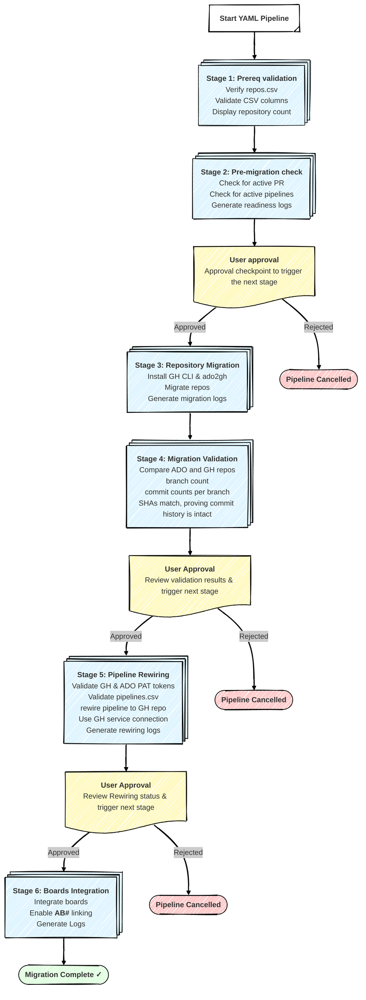

# 🚀 ADO to GitHub Migration Pipeline

[](https://opensource.org/licenses/MIT)
[](https://azure.microsoft.com/en-us/services/devops/)
[](https://github.com/github/gh-ado2gh)

> A production-ready, stage-based Azure DevOps pipeline for migrating repositories from Azure DevOps to GitHub Enterprise at scale. Supports batch migrations, automated validation, pipeline rewiring, and Azure Boards integration.

---
### 🎯 The Challenge

Migrating repositories from Azure DevOps to GitHub Enterprise using a hybrid approach is inherently complex due to the multiple stages involved in the end-to-end migration process.

To address this scalability challenge, I designed a stage-based Azure DevOps YAML pipeline that encapsulates the entire migration lifecycle. This pipeline enables a decentralized, self-service migration model, allowing individual teams to independently migrate only the repositories they own.

By distributing ownership to teams and supporting controlled parallel execution, this approach scales effectively for large enterprises. It avoids centralized bottlenecks and risky big-bang migrations, while making the overall ADO-to-GHE migration process more manageable, auditable, and resilient.

Migrating thousands of repositories from Azure DevOps to GitHub at enterprise scale introduces several key challenges:

- **Script-only approaches don't scale**: Running migration scripts serially from a single machine is too slow for 1,000+ repositories
- **Centralized bottleneck**: One team managing all migrations creates dependency and delays
- **Big-bang risk**: Migrating everything at once increases failure risk and rollback complexity
- **Lack of validation**: Manual post-migration checks are error-prone and time-consuming
- **State management**: Tracking which repos have been migrated, validated, and rewired is complex

### 🧠 The Solution

This pipeline-based approach solves these challenges by:

✅ **Decentralized self-service**: Teams migrate their own repositories on their own schedule  
✅ **Parallel execution**: Multiple migration batches can run concurrently  
✅ **Automated validation**: Built-in checks ensure migration completeness (branches, commits, SHAs)  
✅ **Staged approvals**: Manual gates enforce review before proceeding to next stage  
✅ **Comprehensive logging**: Detailed artifacts enable troubleshooting and audit trails  
✅ **Repeatable process**: YAML pipeline ensures consistency across all migrations


## 📋 Table of Contents

- [Pipeline Overview](#%EF%B8%8F-pipeline-overview)
- [Prerequisites](#%EF%B8%8F-prerequisites)
- [Quick Start](#-quick-start-your-first-migration)
- [Published Artifacts](#%EF%B8%8F-Published-Artifacts)
- [FAQ](#-frequently-asked-questions)
- [Contributing](#-contributing)
- [License](#-license)

---

## ️ Pipeline Overview

This pipeline is designed to run on Ubuntu Linux using Microsoft-hosted Azure Pipelines agents with the `ubuntu-latest` VM image. The pipeline executes 6 stages sequentially, where each stage runs on a completely fresh Ubuntu runner with no state carried over from previous stages.

The three manual approval gates use `pool: server` (no agent required) with a 24-hour timeout, and each regular stage runs with the `condition: succeeded()` to ensure it only executes if the previous stage completed successfully. Since each stage gets a fresh runner, tools like GitHub CLI and the gh-ado2gh extension are reinstalled in every stage that needs them.


> **⚠️ IMPORTANT**: Manual approval gates are enforced after Stage 2, Stage 4, and Stage 5. The pipeline remains paused at the preceding stage until approval is provided. Each of these stages must be manually validated before proceeding to the next stage.

### Stage 1: Prerequisite Validation
- Verifies that `bash/repos.csv` file exists and is not empty
- Validates that the CSV contains all required columns:
  - `org`, `teamproject`, `repo`
  - `github_org`, `github_repo`, `gh_repo_visibility`
- Displays the number of repositories to be migrated

### Stage 2: Pre-migration check
Executes `1_pr_pipeline_check.sh` to:

- Scans source repositories for active pull requests
- Detects active builds, releases pipelines, and pull requests
- Identifies potential blockers before migration begins
- Generates a readiness report
- **⏸️ User approval:** Review readiness before proceeding to next stage 3: Repository Migration

### Stage 3: Repository Migration
Executes `2_migration.sh` to perform the actual migration:

- Installs GitHub CLI and `gh-ado2gh` extension
- Executes parallel migrations (configurable: 1-5 concurrent migrations in the script)
- Migrates repository content, branches, and commit history
- Generates migration status logs for each repository
- Creates a summary CSV with migration results

### Stage 4: Repository Migration Validation
Executes `3_post_migration_validation.sh` to:

-Branch Comparison - Compares branch counts between ADO and GitHub, identifies any missing branches on either side.
-Commit Validation - For each branch, verifies the latest commit SHA matches between ADO and GitHub to ensure complete migration.
-Commit Count Verification - Compares total commit counts per branch between source (ADO) and target (GitHub) to detect any missing commits.
- Generates validation logs with detailed results
- **⏸️ User approval:** Review validation before proceeding to next stage 5: Pipeline Rewiring

### Stage 5: Pipeline Rewiring
Executes `4_rewire_pipeline.sh` to:

- Validate github and ADO tokens.
- Reads pipeline configurations from `bash/pipelines.csv`
- Rewires Azure DevOps pipelines to use GitHub repositories
- Updates service connections and repository sources
- Validates pipeline configurations
- Generates rewiring logs
- **⏸️ User approval:** Review validation before proceeding to next stage 6: boards Integration

### Stage 6: Azure Boards Integration
Executes `5_boards_integration.sh` to:

- Validates GitHub and ADO PAT tokens (for this stage, GitHub PAT tokens should be created with the following scopes: repo; admin:repo_hook; read:user; user:email).
- Integrates Azure Boards with migrated GitHub repositories.
- Enables AB# work item linking in GitHub commits/PRs.

---

## ⚙️ Prerequisites

Before running this pipeline, ensure the following requirements are met:


 #### 1. 🗂️ Define Migration Scope Using CSV Configuration Files: 
 Provide the source and target details in the `repo.csv` and `pipeline.csv` files for the repositories batched for migration. You can use the existing CSV templates in the repository and update them with your repository and pipeline information.

    The `bash/repos.csv` file must exist with the following structure:
 
    **Required columns:**
    - `org` - Azure DevOps organization name
    - `teamproject` - Azure DevOps project name
    - `repo` - Azure DevOps repository name
    - `github_org` - Target GitHub organization
    - `github_repo` - Target GitHub repository name
    - `gh_repo_visibility` - Repository visibility: `private`, `public`, or `internal`

    The `bash/pipelines.csv` file must exist with the following structure for pipeline rewiring:

    **Required columns:**
    - `org` - Azure DevOps organization name
    - `teamproject` - Azure DevOps project name
    - `pipeline` - Pipeline name/path to rewire
    - `github_org` - Target GitHub organization
    - `github_repo` - Target GitHub repository name
    - `serviceConnection` - Azure DevOps GitHub service connection ID

 #### 2. 🔐 Authentication & Access Token Requirements
 Create one Azure DevOps PAT token and two separate GitHub Enterprise PAT tokens with the required scopes - one for repository migration and another specifically for Azure Boards integration.

    **Github PAT for repo migration:**

    - ✅ `repo` (Full control of private repositories)
    - ✅ `workflow` (Update GitHub Action workflows)
    - ✅ `admin:org` (Full control of orgs and teams)
    - ✅ `read:user` (Read user profile data)

    **Github PAT for Boards Integration:**
    - ✅ `repo` (Full control of private repositories)
    - ✅ `admin:repo_hook` (Full control of repository hooks)
    - ✅ `read:user` (Read user profile data)
    - ✅ `user:email` (Access user email addresses)

 
 #### 3. 🧩Azure DevOps Service Connections
 Configure the service connection in Azure DevOps and add the corresponding service connection ID to the pipeline.csv file.(Required for Stage 5)


 #### 4. 🔐 PAT Token Configuration via Azure DevOps Variable Groups
Configure two separate Variable Groups in Azure DevOps to store the PAT tokens as secrets—one Variable Group for the migration pipeline and another for Azure Boards integration - so the pipeline can securely read the appropriate tokens at each stage.
    
**Migration Variable Group:** `core-entauto-github-migration-secrets`

Stages 1–5 (Prerequisites, Pre-Migration Checks, Migration, Validation, and Rewiring) use one set of GitHub PATs, while Stage 6 (Boards Integration) requires separate GitHub PATs with different scopes.

| Variable Name | Description |
|--------------|-------------|
| `GH_PAT` | GitHub Personal Access Token with `admin:org`, `read:user`, `repo`, `workflow` scopes |  
| `ADO_PAT` | Azure DevOps PAT with Code (Read, Write), Build, Service Connections scopes |


**Boards Integration Variable Group:** `azure-boards-integration-secrets`

Used in Stage 6 (Azure Boards Integration) - **SEPARATE token with limited scopes**

| Variable Name | Description |
|--------------|-------------|
| `GH_PAT` | GitHub Personal Access Token with `repo`, `admin:org` scopes |
| `ADO_PAT` | Azure DevOps PAT with Code (Read only), Work Items (Read, Write), Project/Team (Read) |

> **⚠️ IMPORTANT**: Both variable groups are required for the pipeline to run successfully. If either variable group does not exist, the pipeline will fail. Create them prior to the initial pipeline run. If variable groups are created with different names than those referenced above, the YAML must be updated accordingly.

#### 5. Concurrency Settings
Configure the `maxConcurrent` variable in `ado2gh-migration.yml` based on your requirements:

```yaml
variables:
  - group: core-entauto-github-migration-secrets
  - name: maxConcurrent
    value: 3  # Change this value (1-5)
```


---

## 🚀 Quick Start: Your First Migration

1. **Prepare your repos.csv**
   ```bash
   # Navigate to the repository directory
   cd /path/to/ado2gh-ado-pipelines
   # Windows: cd C:\Users\<username>\ado2gh-ado-pipelines
   
   # Edit repos.csv with your test repositories
   code bash/repos.csv
   ```

2. **Add test repository entries** (start with 1-3 repos):
   ```csv
   org,teamproject,repo,github_org,github_repo,gh_repo_visibility
   mycompany,Platform,api-service,mycompany-gh,platform-api,private
   mycompany,Platform,web-frontend,mycompany-gh,platform-web,private
   ```

3. **Commit and push your changes**:
   ```bash
   git add bash/repos.csv
   git commit -m "Add test repositories for first migration"
   git push
   ```

4. **Run the pipeline**: from Azure DevOps.

5. **Monitor Stage 1** (Prerequisite Validation):
   - Should complete in < 3 minute
   - Validates CSV format and displays repository count
   - Check for any errors

6. **Monitor Stage 2** (Pre-migration Check):
   - Reviews readiness report for active PRs and pipelines
   - Download `readiness-logs` artifact to review findings
   - ⏸️ **APPROVAL REQUIRED**: Review and approve/reject based on findings
   - **Decision Criteria:**
     - ✅ **APPROVE**: If NO blocking issues found (active PRs or pipelines)
     - ❌ **REJECT**: If ANY blocking issues found; resolve issues and re-run from Stage 1

7. **Monitor Stage 3** (Repository Migration):
   - Actual migration happens here
   - Monitor logs for progress
   - Download `migration-logs` artifact when complete

8. **Monitor Stage 4** (Migration Validation):
   - Compares branches and commits between ADO and GitHub
   - Download `validation-logs` artifact
   - ⏸️ **APPROVAL REQUIRED**: Review and approve/reject based on findings

9. **Monitor Stage 5** (Pipeline Rewiring):
   - Rewires ADO pipelines to use GitHub repos
   - Download `rewiring-logs` artifact
   - ⏸️ **APPROVAL REQUIRED**: Confirm pipelines rewired successfully and approve/reject based on findings

10. **Monitor Stage 6** (Boards Integration):
    - Integrates Azure Boards with GitHub repos
    - Download `boards-integration-logs` artifact
    - ✅ **Migration Complete!**


---

#### Published Artifacts
The pipeline publishes detailed logs as build artifacts:

- **Migration Logs** (from Stage 3: Migration)
  - **Artifact Name**: `migration-logs`

 - **Migration Validation Logs** (from Stage 4: Migration Validation)
   - **Artifact Name**: `validation-logs`

 - **Pipeline Rewiring Logs** (from Stage 5: Pipeline Rewiring)
   - **Artifact Name**: `rewiring-logs`

 - **Boards Integration Logs** (from Stage 6: Boards Integration)
   - **Artifact Name**: `boards-integration-logs`
  
---

## ❓ Frequently Asked Questions

### Q1: Can multiple teams run this pipeline simultaneously?

**A:** No, concurrent pipeline runs on the same repository can cause conflicts. **Best practice:**
- Coordinate migration schedules across teams
- Use separate CSV files per team
- Run migrations sequentially, not in parallel
- If absolutely necessary, ensure zero repository overlap between teams

---

### Q2: What happens to the ADO repository after migration?

**A:** The ADO repository remains **intact and unchanged**. Migration is a **copy operation**, not a move.

**Post-Migration:**
- ✅ ADO repository is still accessible
- ✅ All history, branches, and commits remain in ADO
- ⚠️ Stage 6 integrates Azure Boards, but does NOT delete ADO repo
- ⚠️ Decommissioning ADO repositories is a **manual process** (out of scope for this pipeline)

**Recommended Decommissioning Process:**
1. Wait 30 days after migration
2. Verify all teams are using GitHub repository
3. Make ADO repository read-only (disable pushes)
4. Archive or delete ADO repository after 90-day retention period

---

### Q3: Can I migrate repositories from multiple ADO organizations?

**A:** Yes, list all repositories in `repos.csv` with different `org` values.

**Requirements:**
- ✅ ADO PAT token must have access to **all organizations**
- ✅ List repos from different orgs in the same CSV

**Example:**

```csv
org,teamproject,repo,github_org,github_repo,gh_repo_visibility
mycompany,Platform,api-service,mycompany-gh,platform-api,private
anothercompany,Services,data-api,mycompany-gh,data-api,private
```

---

### Q4: How long does a typical migration take?

**A:** Highly variable based on repository size and batch size.

---

### Q5: Can I skip Stage 5 (Pipeline Rewiring) if I don't have pipelines?

**A:** No, you cannot skip stages. However, you can provide an **empty `pipelines.csv`** file with just the header row.

**Empty pipelines.csv:**

```csv
org,teamproject,pipeline,github_org,github_repo,serviceConnection
```

Stage 5 will complete quickly with no pipelines to rewire.

---

### Q6: Does this pipeline migrate pull requests?

**A:** No, **pull requests are NOT migrated**.

**What Happens to PRs:**
- ❌ Active PRs in ADO will NOT be transferred to GitHub
- ⚠️ Stage 2 (Pre-migration Check) will **warn if active PRs exist**
- ✅ You must **complete, merge, or abandon PRs** before migration

**Recommendation:**
- Complete all active PRs before migration
- Or manually recreate PRs in GitHub after migration

---

### Q7: Can I migrate private ADO repos to public GitHub repos?

**A:** Yes, use `gh_repo_visibility: public` in repos.csv.

**Security Warning:**
- ⚠️ Migrating private to public **exposes all repository content**
- ⚠️ Commit history, code, and file history become **publicly accessible**
- ⚠️ **Review repository for sensitive data** (API keys, passwords, etc.) before migration

**Recommendation:**
- Scan for secrets using tools like `git-secrets` or `gitleaks`
- Remove sensitive data from history before migration
- Default to `private` unless business requires public

---

### Q8: What happens if migration fails halfway through?

**A:** The pipeline stops, and you can **resume from the failure point**.

**Recovery Steps:**
1. Download `migration-logs` artifact
2. Identify failed repositories in `migration-summary.csv`
3. Create new CSV with only failed repos
4. Re-run pipeline with retry CSV

---

### Q9: How do I validate that migration was successful?

**A:** Use the automated validation in **Stage 4**, plus manual verification:

**Automated Validation (Stage 4):**
- ✅ Branch count comparison
- ✅ Commit count comparison per branch
- ✅ Latest commit SHA verification

---

## 🤝 Contributing

Contributions are welcome! If you'd like to improve this pipeline or documentation:

1. **Fork the repository**
2. **Create a feature branch**: `git checkout -b feature/your-improvement`
3. **Make your changes** and commit: `git commit -m "Add: your improvement description"`
4. **Push to your fork**: `git push origin feature/your-improvement`
5. **Open a Pull Request** with a clear description of your changes

### Reporting Issues

If you encounter bugs or have feature requests:
- Check [existing issues](../../issues) first
- Create a new issue with:
  - Clear description of the problem/request
  - Steps to reproduce (for bugs)
  - Expected vs actual behavior
  - Pipeline logs (if applicable)

Please submit a PR or open an issue.

---

## 📄 License

MIT License

Copyright (c) 2025 Vamsi Cherukuri (<vamsicherukuri@hotmail.com>)

Permission is hereby granted, free of charge, to any person obtaining a copy
of this software and associated documentation files (the "Software"), to deal
in the Software without restriction, including without limitation the rights
to use, copy, modify, merge, publish, distribute, sublicense, and/or sell
copies of the Software, and to permit persons to whom the Software is
furnished to do so, subject to the following conditions:

The above copyright notice and this permission notice shall be included in all
copies or substantial portions of the Software.

THE SOFTWARE IS PROVIDED "AS IS", WITHOUT WARRANTY OF ANY KIND, EXPRESS OR
IMPLIED, INCLUDING BUT NOT LIMITED TO THE WARRANTIES OF MERCHANTABILITY,
FITNESS FOR A PARTICULAR PURPOSE AND NONINFRINGEMENT. IN NO EVENT SHALL THE
AUTHORS OR COPYRIGHT HOLDERS BE LIABLE FOR ANY CLAIM, DAMAGES OR OTHER
LIABILITY, WHETHER IN AN ACTION OF CONTRACT, TORT OR OTHERWISE, ARISING FROM,
OUT OF OR IN CONNECTION WITH THE SOFTWARE OR THE USE OR OTHER DEALINGS IN THE
SOFTWARE.

---

**Made with ❤️ for the DevOps community**


